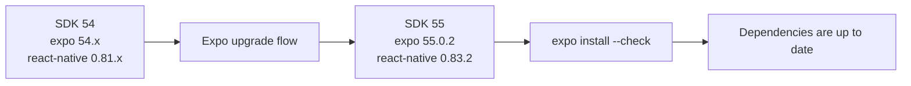

# Daycare App Expo SDK 55 Upgrade

The `daycare-app` workspace was upgraded from Expo SDK 54 to SDK 55 using Expo-managed dependency ranges.
This aligns React, React Native, Expo Router, and native Expo modules with the SDK 55 compatibility matrix.

