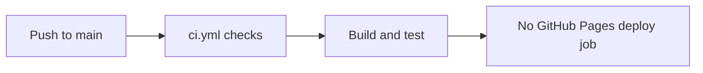

# Daycare App Web Publishing

GitHub Pages publishing has been removed for `packages/daycare-app`.

## Current flow

## Notes

- The dedicated Pages workflow (`.github/workflows/daycare-app-pages.yml`) was removed.
- `packages/daycare-app/app.config.js` no longer reads `EXPO_PUBLIC_BASE_URL` for Pages subpath hosting.
