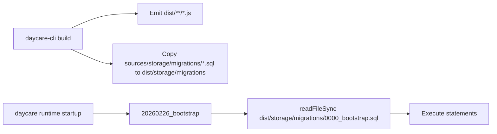

# Daycare CLI Migration SQL Assets

The CLI bootstrap migration (`20260226_bootstrap`) reads `0000_bootstrap.sql` from a path relative to `dist/storage/migrations`.

The build step now explicitly copies SQL migration assets into `dist/storage/migrations` so global npm installs include required files.

