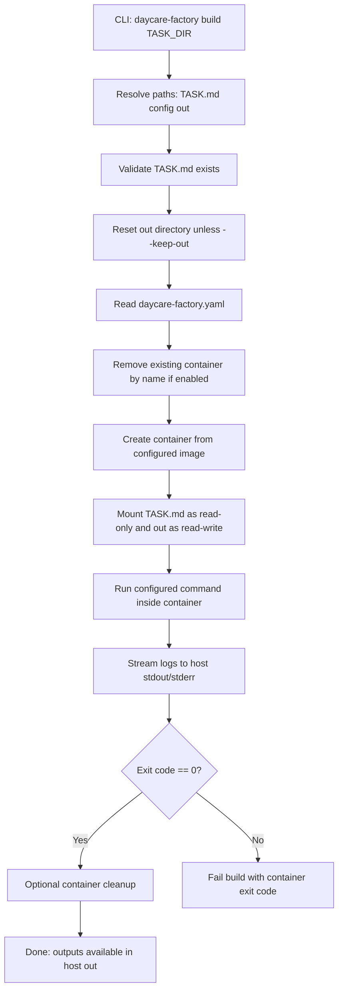

# daycare-factory

## Overview

`daycare-factory` is a CLI wrapper that runs a containerized build using a task folder containing `TASK.md` and `daycare-factory.yaml`.

The host `out/` folder is bind-mounted into the container so build artifacts are produced directly on the host.

## Build flow

## Config contract

Required field:
- `image`: Docker image used to start the build container.

Optional fields:
- `containerName`: stable container name; defaults to `daycare-factory-<task-folder-name>`.
- `command`: command array executed in the container.
- `workingDirectory`: container working directory.
- `taskMountPath`: mount target for `TASK.md`.
- `outMountPath`: mount target for host `out/`.
- `env`: environment variables for the container process.
- `removeExistingContainer`: remove previous container with same name before run.
- `removeContainerOnExit`: remove container after run.
