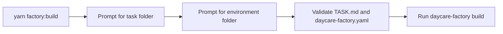
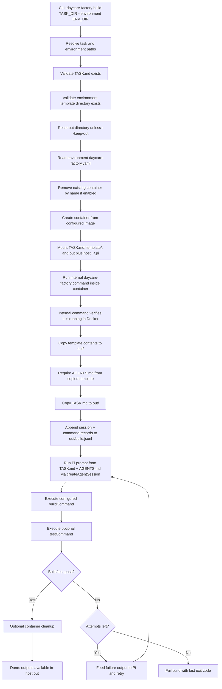
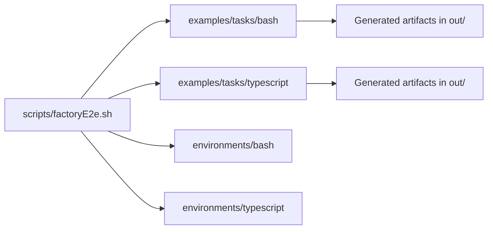

# daycare-factory

## Overview

`daycare-factory` is a CLI wrapper that runs a containerized build using:
- a task folder with `TASK.md`
- a separate environment folder with `daycare-factory.yaml` and `template/`

The host `out/` folder is bind-mounted into the container so build artifacts are produced directly on the host.
The host `~/.pi` directory is bind-mounted as read-only to provide Pi auth (`~/.pi/agent/auth.json`) to the container.

## Root helper script

The repository root includes `yarn factory:build`, which prompts for:
- a task folder containing `TASK.md`
- an environment folder (defaults to `packages/daycare-factory/environments/typescript`)

It then runs `daycare-factory build <taskDir> --environment <envDir>` via
`yarn workspace daycare-factory run dev --`.

## Build flow

Pi prompt/auth failures are treated as hard failures. The flow does not include
fallback behavior.

## Repo-backed E2E fixture

The e2e script uses committed fixture folders for two samples:
- `packages/daycare-factory/examples/tasks/bash`
- `packages/daycare-factory/examples/tasks/typescript`
- `packages/daycare-factory/environments/bash`
- `packages/daycare-factory/environments/typescript`

## Config contract

Required field:
- `image`: Docker image used to start the build container.
- `buildCommand`: command array executed by the in-container internal runner.

Optional fields:
- `testCommand`: command array executed after `buildCommand` for validation.
- `testMaxAttempts`: max correction attempts when `testCommand` fails (default `5`).
- `containerName`: stable container name; defaults to `daycare-factory-<task-folder-name>`.
- `command`: command array executed in the container.
- `workingDirectory`: container working directory.
- `taskMountPath`: mount target for `TASK.md`.
- `templateMountPath`: mount target for environment `template/`.
- `outMountPath`: mount target for host `out/`.
- `env`: environment variables for the container process.
- `removeExistingContainer`: remove previous container with same name before run.
- `removeContainerOnExit`: remove container after run.

## History output

Each build attempt appends JSON lines to `out/build.jsonl` including:
- Pi session events (`pi.*`)
- command results (`command.build`, `command.test`)
- attempt boundaries (`attempt.start`)
