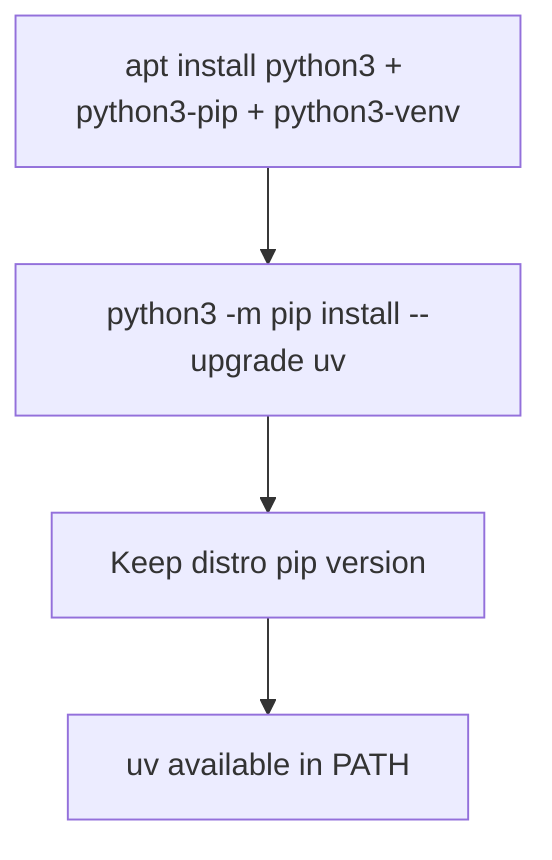

# Daycare Runtime Python Bootstrap

## Summary

`packages/daycare-runtime/Dockerfile` now installs `uv` without attempting to upgrade the apt-managed `pip` package.

The previous command upgraded `pip` and `uv` together. On Debian/Ubuntu package-managed Python, this can fail during
`pip` uninstall because distro-managed installs may not have a removable `RECORD` file.

## Install Flow



## Why

- Keeps Docker builds compatible with distro-managed Python packaging.
- Avoids `Cannot uninstall pip ... RECORD file not found` failures.
- Still provides `uv` for modern Python workflows in the runtime image.

## Rustup Environment Scope

The Rust install layer now exports `HOME`, `CARGO_HOME`, and `RUSTUP_HOME` before piping into `sh`.

This avoids shell-scope issues where `CARGO_HOME`/`RUSTUP_HOME` could apply to `curl` only, causing `rustup` to install
outside `/usr/local/cargo` and making `/usr/local/cargo/bin/rustc` unavailable in the same Docker layer.

```mermaid
flowchart TD
    A[Inline vars before piped command] --> B[Only curl gets vars]
    B --> C[rustup installs under default HOME cargo dir]
    C --> D[/usr/local/cargo/bin/rustc missing]
    E[export HOME/CARGO_HOME/RUSTUP_HOME first] --> F[curl and sh share env]
    F --> G[rustc and cargo resolve in /usr/local/cargo/bin]
```
