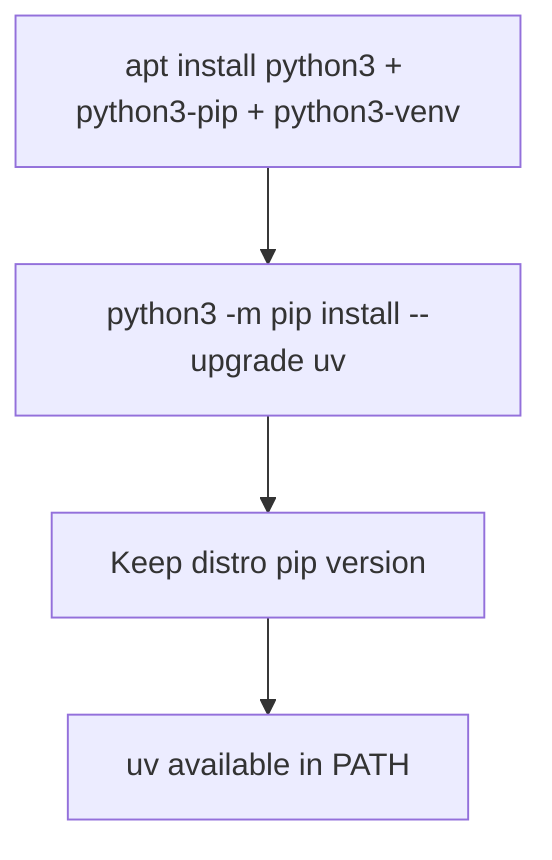

# Daycare Runtime Python Bootstrap

## Summary

`packages/daycare-runtime/Dockerfile` now installs `uv` without attempting to upgrade the apt-managed `pip` package.

The previous command upgraded `pip` and `uv` together. On Debian/Ubuntu package-managed Python, this can fail during
`pip` uninstall because distro-managed installs may not have a removable `RECORD` file.

## Install Flow

## Why

- Keeps Docker builds compatible with distro-managed Python packaging.
- Avoids `Cannot uninstall pip ... RECORD file not found` failures.
- Still provides `uv` for modern Python workflows in the runtime image.
