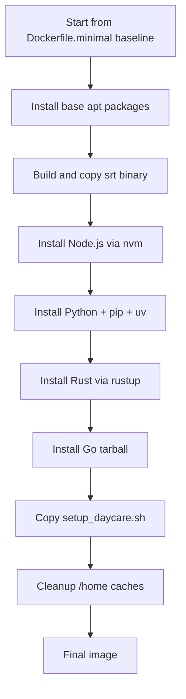

# Daycare Runtime Image

## Summary

`packages/daycare-runtime` provides two Dockerfiles:
- `Dockerfile.minimal`: base runtime with srt + Node.js toolchain
- `Dockerfile`: full runtime copied from `Dockerfile.minimal` and extended with Python/pip/uv, Rust, and Go

Both images keep `ENTRYPOINT ["sleep", "infinity"]` and use `/opt/daycare/setup_daycare.sh` for env-based setup.

## Full Image Layout



## Read-only Home Behavior

The runtime assumes `/home` is mounted from outside and can be reset between runs.
- container `HOME` points to `/home`
- Docker sandbox execution keeps the bind mount root as `/home` for runtime path rewriting
- cache directories are routed through `/home/developer/.cache`
- writable runtime state (Go modules, Cargo cache) stays under `/home/developer`
- toolchain installs for Rust/Go/Node live outside `/home` so remount/reset does not remove them

```mermaid
flowchart LR
    A[/home (external mount)] --> B[cache + workspace state]
    B --> C[/home/developer/.cargo + /home/developer/go]
    D[/usr/local/rustup + /usr/local/go + /root/.nvm] --> E[installed toolchains]
    B -. resettable .-> F[new session home]
    E --> G[toolchains still available]
```
