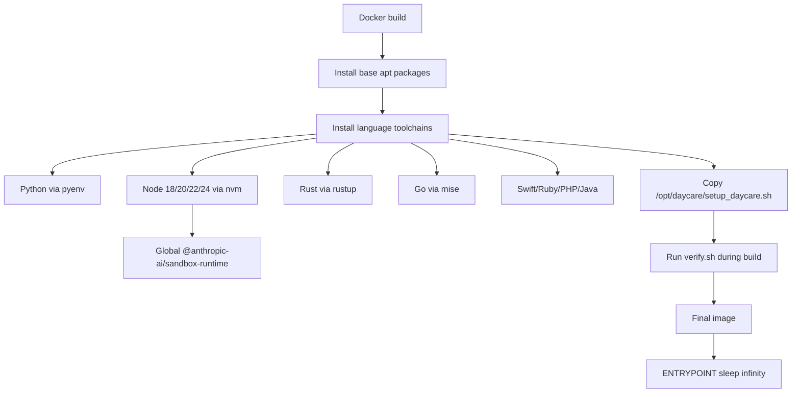

# Daycare Runtime Image

## Summary

Added `packages/daycare-runtime` as a Daycare-adapted runtime image based on `openai/codex-universal`.

Key adjustments:
- renamed setup contract from `CODEX_ENV_*` to `DAYCARE_ENV_*`
- renamed setup script path to `/opt/daycare/setup_daycare.sh`
- installed global Node tool `@anthropic-ai/sandbox-runtime`
- changed container entrypoint to `sleep infinity`

## Runtime Layout

## Setup Contract

`/opt/daycare/setup_daycare.sh` reads these variables:
- `DAYCARE_ENV_PYTHON_VERSION`
- `DAYCARE_ENV_NODE_VERSION`
- `DAYCARE_ENV_RUST_VERSION`
- `DAYCARE_ENV_GO_VERSION`
- `DAYCARE_ENV_SWIFT_VERSION`
- `DAYCARE_ENV_RUBY_VERSION`
- `DAYCARE_ENV_PHP_VERSION`
- `DAYCARE_ENV_JAVA_VERSION`

When set, each variable switches the active runtime to that installed version.
