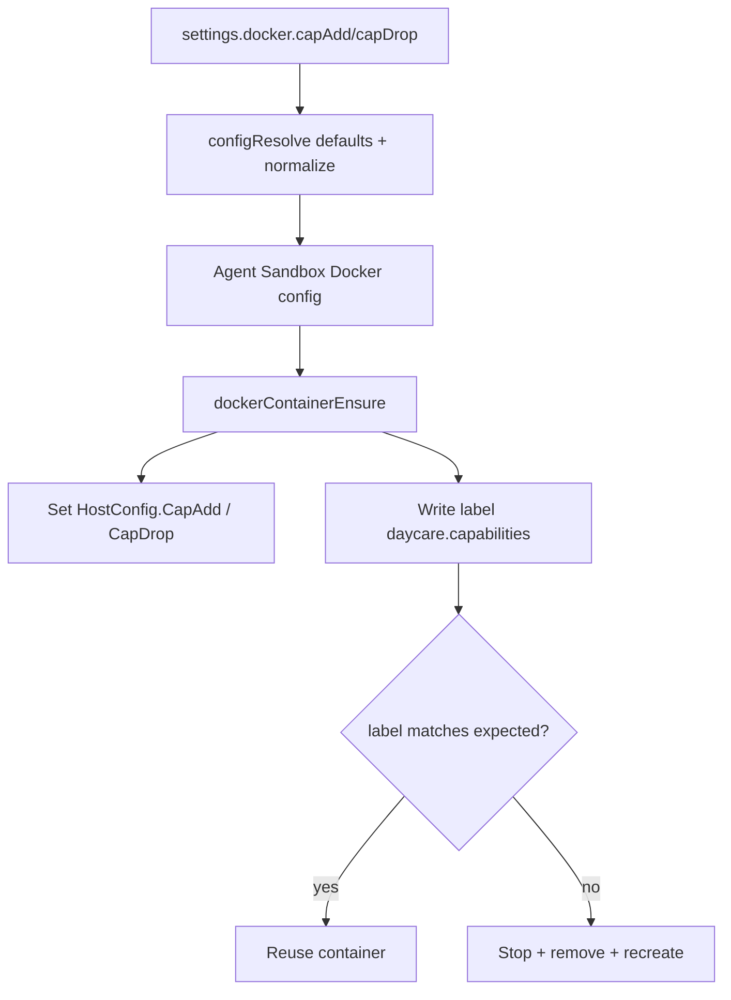

# Docker Container Capabilities

Daycare Docker sandbox containers now support capability configuration through `settings.json`:

```json
{
    "docker": {
        "capAdd": ["NET_ADMIN"],
        "capDrop": ["MKNOD"]
    }
}
```

Behavior:

- `docker.capAdd` maps to `HostConfig.CapAdd`
- `docker.capDrop` maps to `HostConfig.CapDrop`
- both default to `[]`

To apply config changes safely, Daycare stamps containers with a deterministic `daycare.capabilities` label. If
configured capabilities change, `dockerContainerEnsure` treats the container as stale and recreates it.


