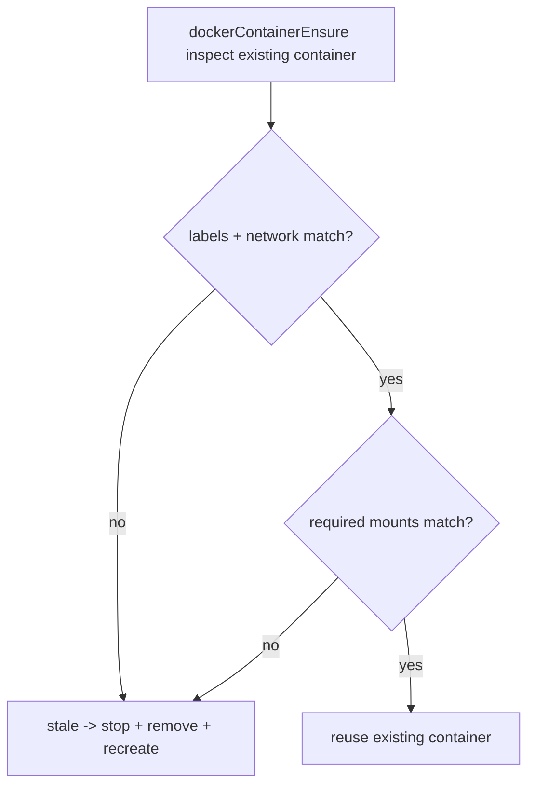

# Docker Examples Mount Stale Check

Daycare now validates required bind mounts when reusing an existing sandbox Docker container.

## What Changed

- `dockerContainerEnsure` now checks container mounts for:
  - host home -> `/home` (read-write)
  - active skills -> `/shared/skills` (read-only)
  - bundled examples -> `/shared/examples` (read-only)
- If any required mount is missing or mismatched, the container is treated as stale and recreated.

This ensures Docker mode always exposes `/shared/examples` to sandboxed execs after upgrades or config drift.

