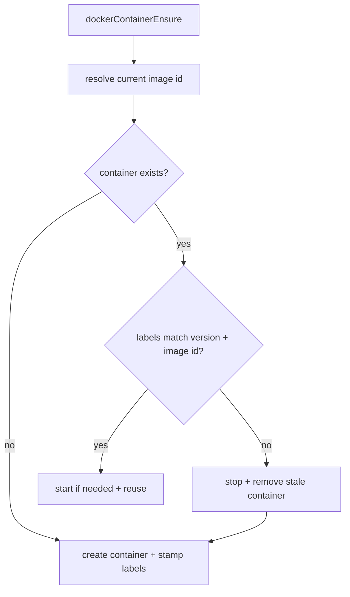
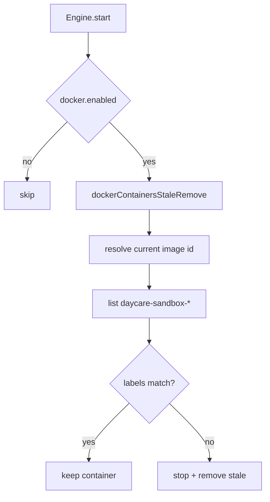

# Docker Image Version Guard

Daycare now detects stale sandbox containers using two metadata labels written at container creation:

- `daycare.image.version` from `DOCKER_IMAGE_VERSION`
- `daycare.image.id` from Docker image inspect (`Id`)

Containers are stale when labels are missing or values mismatch current runtime values.

## Ensure Path

## Startup Scan

## Operational Note

When the sandbox image behavior changes, bump `DOCKER_IMAGE_VERSION` in
`packages/daycare/sources/sandbox/docker/dockerImageVersion.ts` to force container replacement.
