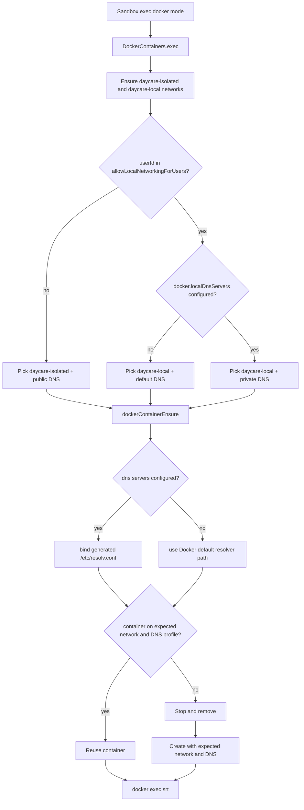

# Docker Local-Network Isolation

## Summary

Docker sandbox containers now default to an isolated network profile so local-network access is denied by default.

An exception list in `settings.json` allows local networking for specific users:

```json
{
    "docker": {
        "enabled": true,
        "allowLocalNetworkingForUsers": ["user-admin", "user-dev"]
    }
}
```

Optional DNS settings can override default resolver behavior:

```json
{
    "docker": {
        "isolatedDnsServers": ["1.1.1.1", "8.8.8.8"],
        "localDnsServers": ["192.168.0.1"]
    }
}
```

## Behavior

- Default users run on `daycare-isolated`.
- Users in `docker.allowLocalNetworkingForUsers` run on `daycare-local`.
- Daycare ensures both networks exist before executing container commands.
- `daycare-isolated` containers use `docker.isolatedDnsServers` (default: `1.1.1.1`, `8.8.8.8`) so they do not
  depend on local DNS infrastructure.
- `daycare-local` containers use Docker default DNS unless `docker.localDnsServers` is set.
- When DNS servers are configured, Daycare bind-mounts a generated `/etc/resolv.conf` with those resolvers to avoid
  Docker embedded DNS (`127.0.0.11`) runtime issues.
- If a user's existing container is on the wrong network, Daycare recreates it on the correct one.

## Network Selection Flow


