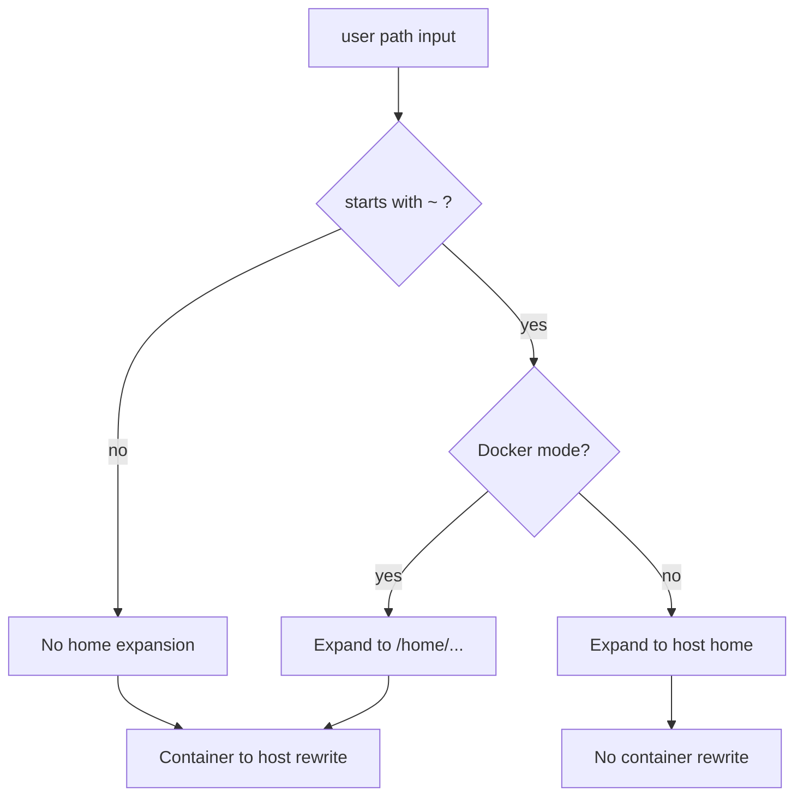

# Docker Read `~` Path Mapping

## Summary
`read_json` and `read` support `~` paths.
In Docker mode, sandbox paths are container-relative, so `~` must mean container home (`/home`) before host rewrite happens.

Previously, `~` was expanded directly to the host home path, then the Docker rewriter also interpreted it as `/home/...` and rewrote it again.
That produced doubled host prefixes for some users.

## Fix
- Added `sandboxReadPathNormalize()` as a dedicated helper.
- In Docker mode, `~` expands to `/home` and `~/...` expands to `/home/...`.
- In non-Docker mode, `~` still expands to the host home directory.

## Flow

