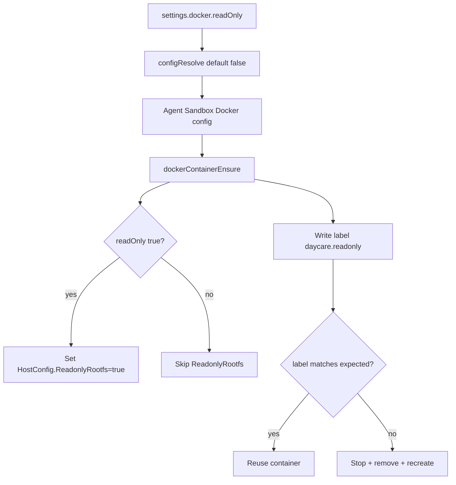

# Docker Read-Only Root Filesystem

Daycare Docker sandbox containers support a `readOnly` setting in `settings.json`:

```json
{
    "docker": {
        "readOnly": true
    }
}
```

Behavior:

- `docker.readOnly` defaults to `false`
- when `true`, Daycare sets `HostConfig.ReadonlyRootfs: true`
- `/home` remains writable through the existing bind mount
- `/shared/skills` remains read-only

To apply config changes safely, Daycare stamps containers with `daycare.readonly` (`"1"` or `"0"`).
`dockerContainerEnsure` recreates the container when this label does not match the current config.


