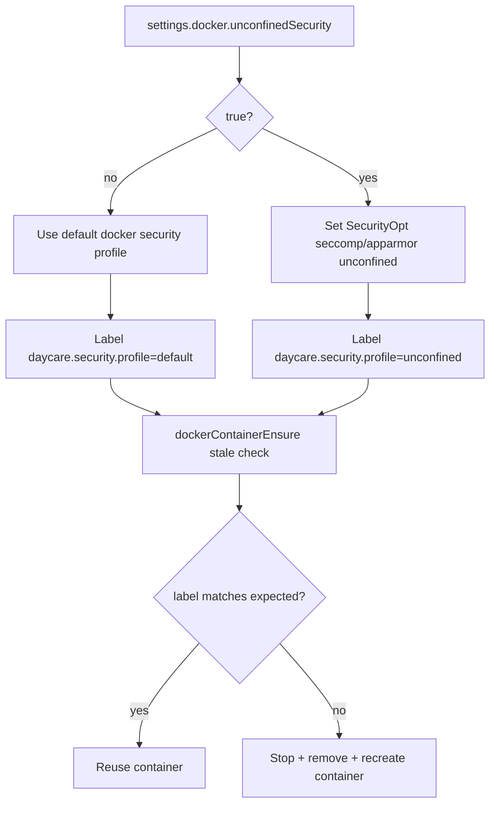

# Docker Unconfined Security Opts

Daycare now supports enabling Docker security opts for sandbox containers through `settings.json`:

```json
{
    "docker": {
        "unconfinedSecurity": true
    }
}
```

When enabled, Daycare creates sandbox containers with:

- `--security-opt seccomp=unconfined`
- `--security-opt apparmor=unconfined`

When disabled (default), Daycare leaves Docker `SecurityOpt` unset.

To keep behavior deterministic, container metadata now stores `daycare.security.profile` (`default` or `unconfined`).
If the setting changes, Daycare treats the existing container as stale and recreates it on next ensure.


