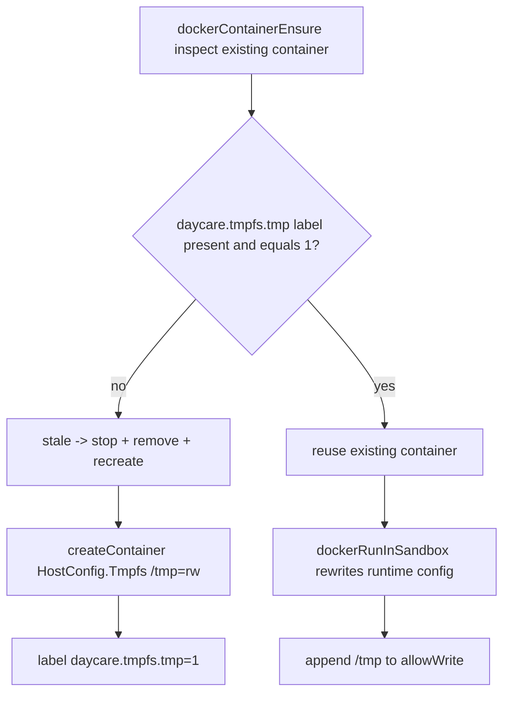

# Docker `/tmp` Tmpfs Mount

Daycare Docker sandbox containers now mount `/tmp` as a writable tmpfs.

## What Changed

- `dockerContainerEnsure` sets `HostConfig.Tmpfs["/tmp"] = "rw"` when creating sandbox containers.
- Containers are labeled with `daycare.tmpfs.tmp = "1"` to track this runtime requirement.
- Existing containers missing this label are treated as stale and recreated.
- Docker `exec` runtime config now always includes `/tmp` in sandbox `allowWrite`.

This guarantees writable temporary space in Docker mode even when rootfs constraints are enabled.

