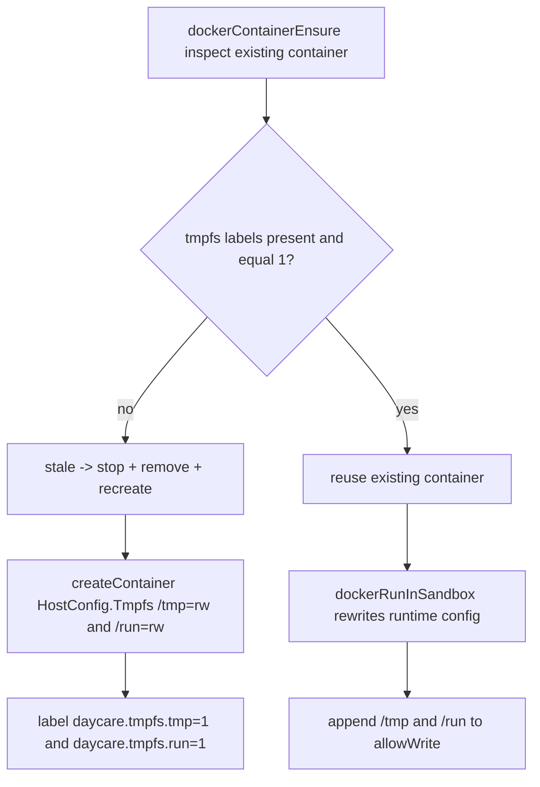

# Docker `/tmp` and `/run` Tmpfs Mounts

Daycare Docker sandbox containers mount `/tmp` and `/run` as writable tmpfs.

## What Changed

- `dockerContainerEnsure` sets `HostConfig.Tmpfs["/tmp"] = "rw"` and `HostConfig.Tmpfs["/run"] = "rw"` when creating
  sandbox containers.
- Containers are labeled with `daycare.tmpfs.tmp = "1"` and `daycare.tmpfs.run = "1"` to track these runtime
  requirements.
- Existing containers missing either label are treated as stale and recreated.
- Docker `exec` runtime config always includes `/tmp` and `/run` in sandbox `allowWrite`.

This guarantees writable temporary space in Docker mode even when rootfs constraints are enabled.

