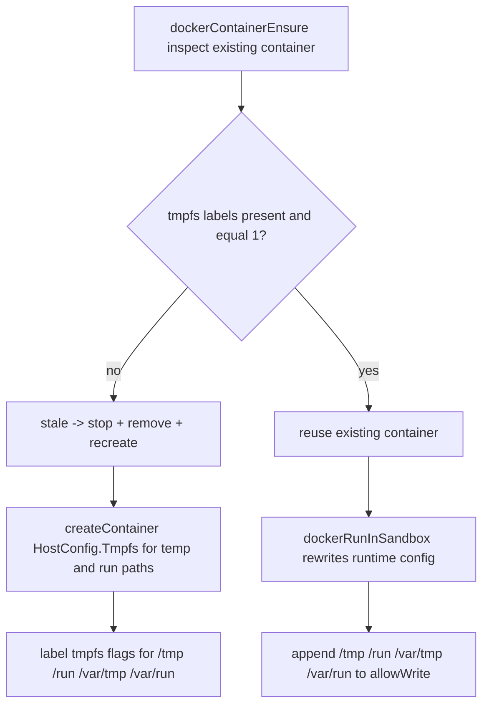

# Docker Tmpfs Mounts for Temp and Run Paths

Daycare Docker sandbox containers mount `/tmp`, `/run`, `/var/tmp`, and `/var/run` as writable tmpfs.

## What Changed

- `dockerContainerEnsure` sets `HostConfig.Tmpfs["/tmp"]`, `HostConfig.Tmpfs["/run"]`,
  `HostConfig.Tmpfs["/var/tmp"]`, and `HostConfig.Tmpfs["/var/run"]` to `"rw"` when creating sandbox containers.
- Containers are labeled with `daycare.tmpfs.tmp = "1"`, `daycare.tmpfs.run = "1"`,
  `daycare.tmpfs.var_tmp = "1"`, and `daycare.tmpfs.var_run = "1"` to track these runtime requirements.
- Existing containers missing any required tmpfs label are treated as stale and recreated.
- Docker `exec` runtime config always includes `/tmp`, `/run`, `/var/tmp`, and `/var/run` in sandbox `allowWrite`.

This guarantees writable temporary space in Docker mode even when rootfs constraints are enabled.

