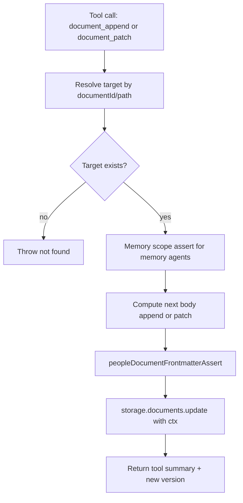

# Document Append and Patch Tools

Added two core tools for incremental document updates without rewriting the whole body:

- `document_append`: appends raw text to the end of an existing document body.
- `document_patch`: applies an exact-text patch object `{ search, replace, replaceAll? }`.

Both tools:

- resolve targets by `documentId` or `path` (`~/...`)
- run user-scoped document lookup via `ctx`
- enforce memory-agent write scope (`~/memory` subtree only)
- validate people document frontmatter rules before saving
- return `{ summary, documentId, version }` (+ patch counts for `document_patch`)

