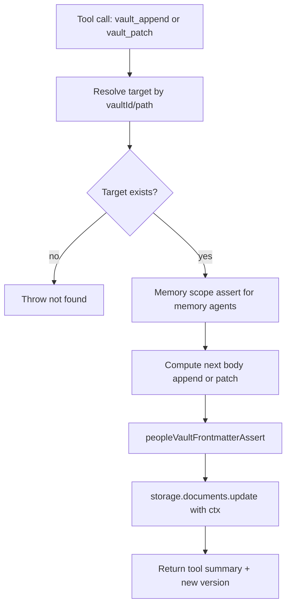

# Vault Append and Patch Tools

Added two core tools for incremental vault updates without rewriting the whole body:

- `vault_append`: appends raw text to the end of an existing vault body.
- `vault_patch`: applies an exact-text patch object `{ search, replace, replaceAll? }`.

Both tools:

- resolve targets by `vaultId` or `path` (`vault://...`)
- run user-scoped document lookup via `ctx`
- enforce memory-agent write scope (`vault://memory` subtree only)
- validate people vault frontmatter rules before saving
- return `{ summary, vaultId, version }` (+ patch counts for `vault_patch`)

