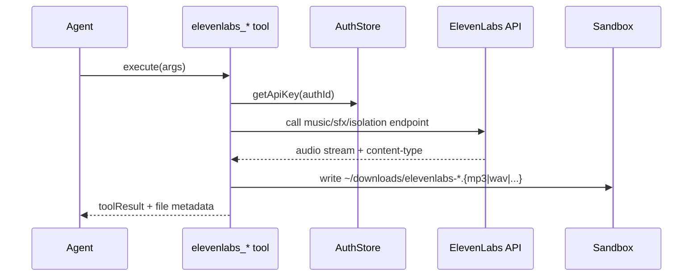

# ElevenLabs Direct Tools

The ElevenLabs plugin now registers three direct tools in addition to speech provider integration:

- `elevenlabs_generate_music`
- `elevenlabs_generate_sound_effects`
- `elevenlabs_voice_isolator`

All tools resolve API keys from auth storage (`authId`, default `elevenlabs`) and save generated files into sandbox downloads.

## Output format behavior

- Music and sound effects accept shorthand aliases: `mp3` and `mpeg` map to `mp3_44100_128`.
- Voice isolator derives output extension from response `content-type`.
- Tool result payload includes `filePath`, `fileName`, `mimeType`, and `size`.
