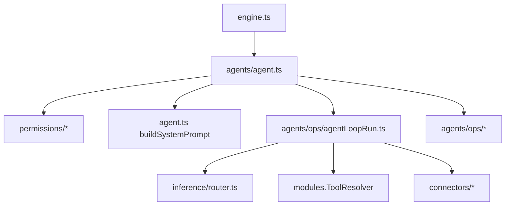
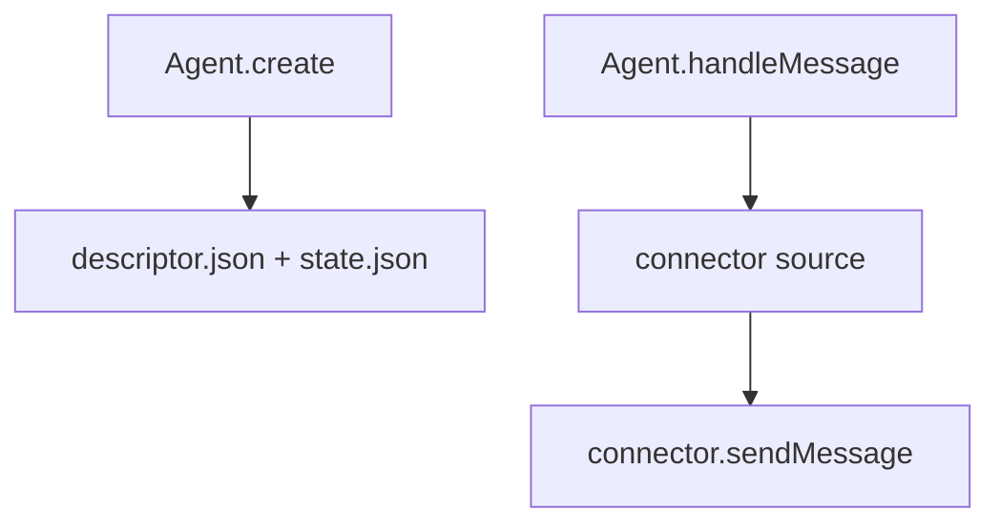
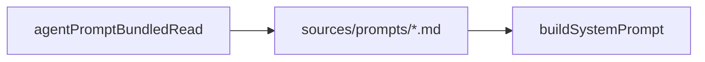
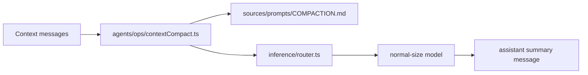
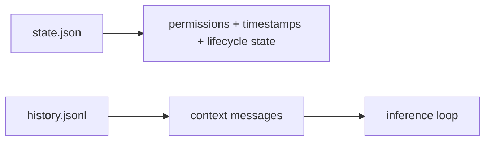
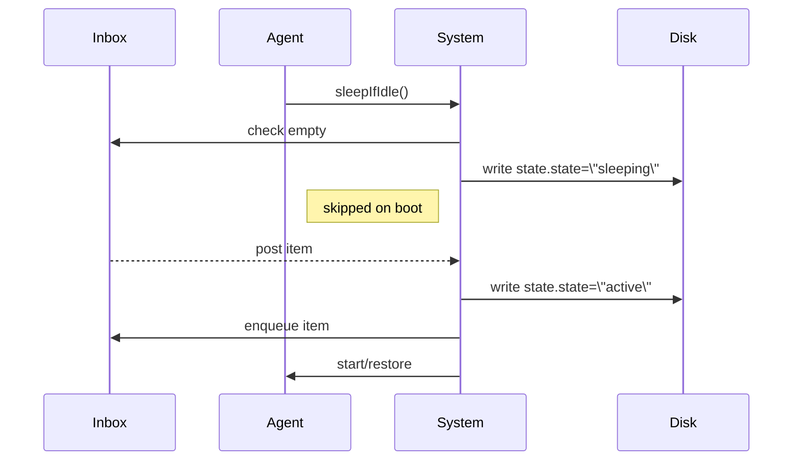
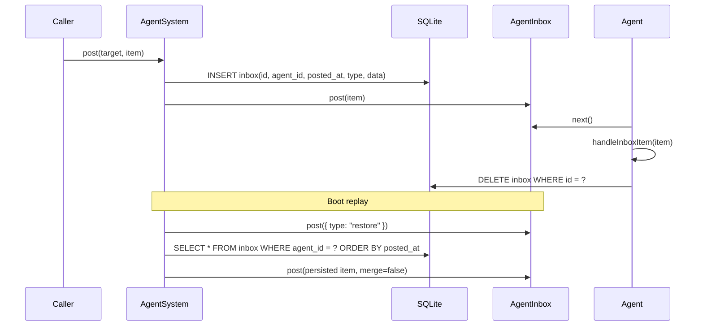

# Engine Agent Loop

The Agent owns the end-to-end agent loop:
- resolve permissions (cron/heartbeat)
- build the system prompt + tool context
- run the inference/tool loop
- persist state and emit outgoing events



## Agent Creation

Agent creation is deterministic and does not depend on inbound message context.
Message delivery uses the inbound connector source; system messages derive the connector
from the target agent descriptor.



## Bundled Prompt Resolution

System prompt templates are bundled under `sources/prompts/` and read through
`agentPromptBundledRead`.



## Context Compaction

Long-running sessions can be compacted into a single summary message using the
COMPACTION prompt and a normal-size model selection.



## Inference Error Handling

Inference error responses are treated as normal failures and do not trigger
automatic emergency session reset.

```mermaid
flowchart LR
  Inference[inference/router.ts] --> Error[stopReason=error]
  Error --> Notify[send \"Inference failed.\"]
  Notify --> Continue[session state preserved]
```

## Reset System Messages

Reset markers can carry an optional message that is injected as a system-level
note at the beginning of the next context so models understand why a reset happened.

```mermaid
flowchart LR
  ResetRecord[history.jsonl reset + message] --> Build[buildHistoryContext]
  Build --> SystemMsg[<system_message origin=\"<agentId>\">...]
  SystemMsg --> Context[context messages]
```

## State vs History

`state.json` only stores durable metadata (permissions, timestamps, lifecycle state).
Conversation context is rebuilt from `history.jsonl` instead of being persisted in state.



## Agent Sleep Mode

After processing a message or reset, the agent marks itself sleeping when the inbox is empty.
Sleeping agents are skipped on boot and only restored when a new inbox item arrives, which
wakes them before enqueueing.



## Durable Inbox

Queued inbox work now persists in SQLite (`inbox` table) so items survive process restarts.
`post()` writes first, the agent loop deletes rows after handling each item, and boot replay
restores queued rows after a synthetic `restore` item.


