# Engine Message and Agent Helper Extraction

Extracted message-formatting helpers and agent normalization utilities into dedicated modules for easier reuse and testing.

```mermaid
flowchart TD
  Engine[engine.ts] --> MsgBuild[messageBuildUser.ts]
  Engine --> MsgFormat[messageFormatIncoming.ts]
  Engine --> MsgExtractText[messageExtractText.ts]
  Engine --> MsgExtractTools[messageExtractToolCalls.ts]
  Engine --> MsgNoMessage[messageNoMessageIs.ts]
  Engine --> MsgSystem[messageBuildSystemText.ts]
  Engine --> MsgSystemSilent[messageBuildSystemSilentText.ts]
  Engine --> MsgIsSystem[messageIsSystemText.ts]
  Engine --> MsgUserFacing[messageBuildUserFacing.ts]
  Engine --> MsgIsUserFacing[messageIsUserFacing.ts]
  Engine --> AgentBuild[agentDescriptorBuild.ts]
  Engine --> AgentKey[agentKeyBuild.ts]
  Engine --> AgentTarget[agentDescriptorTargetResolve.ts]
  Engine --> AgentCron[agentDescriptorIsCron.ts]
  Engine --> AgentHeartbeat[agentDescriptorIsHeartbeat.ts]
  Engine --> AgentTimestamp[agentTimestampGet.ts]
```

`messageNoMessageIs.ts` detects the `NO_MESSAGE` sentinel so the runtime can suppress user-facing output
without leaking the sentinel into future model context.

`messageBuildSystemSilentText.ts` wraps text in `<system_message_silent>` tags for silent system messages
(added to context for awareness without triggering inference).

`messageBuildUserFacing.ts` wraps text in `<message_for_user origin="agentId">` tags for background agents
that need the foreground agent to present content to the user. `messageIsUserFacing.ts` detects this tag.
