# Engine Message and Agent Helper Extraction

Extracted message-formatting helpers and agent normalization utilities into dedicated modules for easier reuse and testing.

```mermaid
flowchart TD
  Engine[engine.ts] --> MsgBuild[messageBuildUser.ts]
  Engine --> MsgFormat[messageFormatIncoming.ts]
  Engine --> MsgExtractText[messageExtractText.ts]
  Engine --> MsgExtractTools[messageExtractToolCalls.ts]
  Engine --> MsgNoMessage[messageNoMessageIs.ts]
  Engine --> MsgSystem[messageBuildSystemText.ts]
  Engine --> MsgIsSystem[messageIsSystemText.ts]
  Engine --> AgentBuild[agentDescriptorBuild.ts]
  Engine --> AgentKey[agentKeyBuild.ts]
  Engine --> AgentTarget[agentDescriptorTargetResolve.ts]
  Engine --> AgentCron[agentDescriptorIsCron.ts]
  Engine --> AgentHeartbeat[agentDescriptorIsHeartbeat.ts]
  Engine --> AgentTimestamp[agentTimestampGet.ts]
```

`messageNoMessageIs.ts` detects the `NO_MESSAGE` sentinel so the runtime can suppress user-facing output
without leaking the sentinel into future model context.
