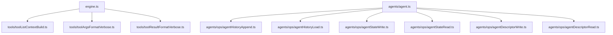

# Engine Tool and Agent Extractions

Extracted tool list selection, verbose tool formatting, and agent persistence helpers into dedicated modules.

```mermaid
flowchart TD
  Engine[engine.ts] --> ToolList[tools/toolListContextBuild.ts]
  Engine --> ToolArgs[tools/toolArgsFormatVerbose.ts]
  Engine --> ToolResult[tools/toolResultFormatVerbose.ts]
  Agent[agents/agent.ts] --> HistoryAppend[agents/ops/agentHistoryAppend.ts]
  Agent --> HistoryLoad[agents/ops/agentHistoryLoad.ts]
  Agent --> StateWrite[agents/ops/agentStateWrite.ts]
  Agent --> StateRead[agents/ops/agentStateRead.ts]
  Agent --> DescriptorWrite[agents/ops/agentDescriptorWrite.ts]
  Agent --> DescriptorRead[agents/ops/agentDescriptorRead.ts]
```
