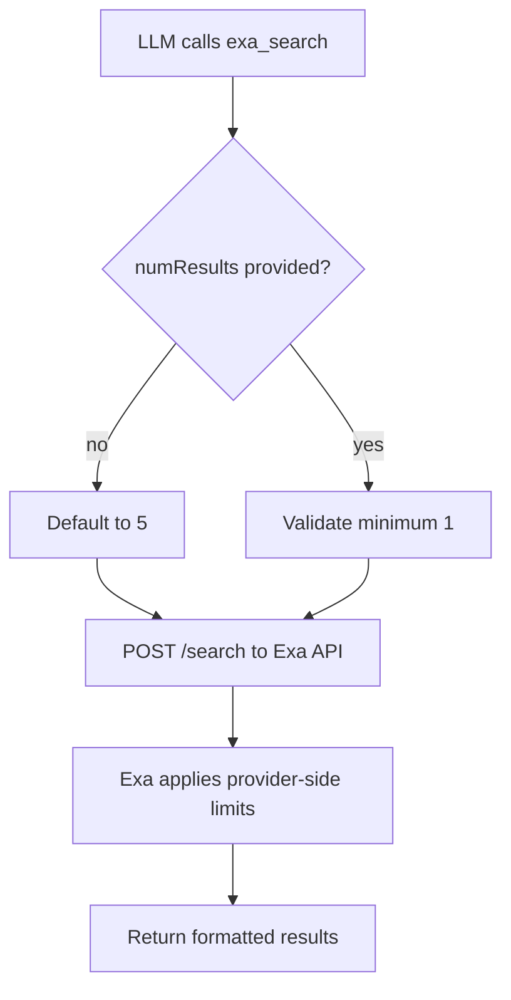

# Exa `numResults` Unbounded

`exa_search` no longer enforces a hard upper limit for `numResults` in the Daycare tool schema.

- Before: `numResults` accepted `1..10`.
- After: `numResults` accepts `>= 1`.

The request value is forwarded to Exa as-is; provider-side limits remain enforced by Exa.

