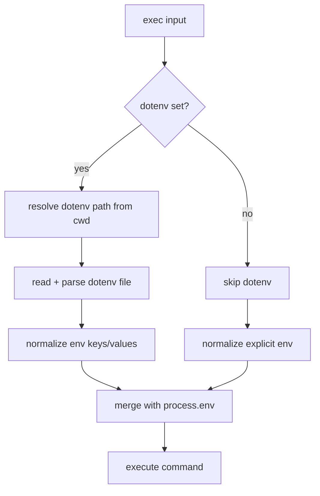

# Exec Environment Variables

`exec` supports two environment inputs:
- `env`: inline key/value overrides (string, number, boolean)
- `dotenv`: `true` (load `.env` from `cwd` if present) or a dotenv file path (absolute or `cwd`-relative)

Keys are trimmed and invalid keys are ignored. Values are coerced to strings.

Merge order:
1. `process.env`
2. dotenv values (if loaded)
3. explicit `env` values

This means explicit `env` always wins over dotenv entries.

Example:
```json
{
  "command": "node scripts/check.js",
  "cwd": "/workspace/app",
  "dotenv": true,
  "env": {
    "NODE_ENV": "production",
    "PORT": 3000,
    "VERBOSE": true
  }
}
```


