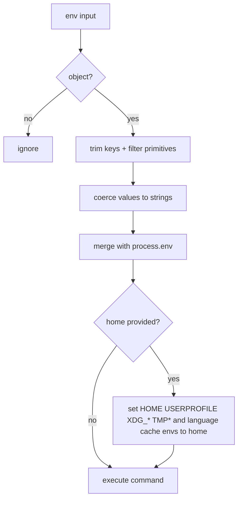

# Exec Environment Variables

`exec` accepts an optional `env` map to inject environment variables into the
command runtime. Keys are trimmed and blank keys are ignored. Values accept strings,
numbers, or booleans and are coerced to strings before execution. The base environment
is built by merging the normalized overrides onto `process.env`.

They also accept `home` (absolute path) to remap home-related environment variables for
the command. This helps package managers and CLI tools avoid reading or writing the real
user home. Internally this is forwarded to sandbox runtime as the `home` option.

Example:
```json
{
  "command": "node scripts/check.js",
  "home": "/absolute/path/in/workspace/.daycare-home",
  "env": {
    "NODE_ENV": "production",
    "PORT": 3000,
    "VERBOSE": true
  }
}
```


