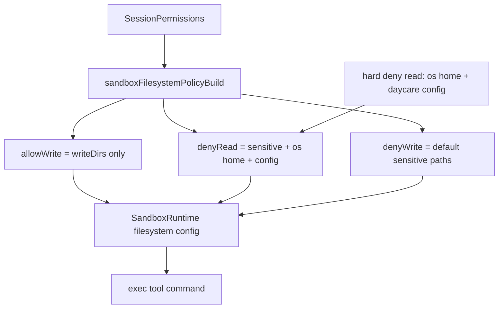

# Exec Filesystem Denylist

`exec` now applies a default filesystem deny policy in the sandbox for both reads and writes.
This is a defense-in-depth layer for sensitive host paths (for example `~/.ssh`) on Linux and macOS.

Read deny policy is stricter than write deny policy:
- `denyRead` includes sensitive paths plus hard-deny roots:
  - OS home (`os.homedir()`)
  - Daycare config root (`~/.daycare` or `DAYCARE_ROOT_DIR`)
- `denyWrite` keeps the sensitive-path set only

Policy shape:
- `allowWrite`: granted `writeDirs` only
- `denyRead`: sensitive paths + hard-deny roots (OS home/config)
- `denyWrite`: default sensitive paths

Default sensitive paths include:
- Home secrets: `~/.ssh`, `~/.gnupg`, `~/.aws`, `~/.kube`, `~/.docker`, `~/.netrc`
- Linux/macOS system secrets: `/etc/ssh`, `/etc/sudoers`, `/etc/shadow`, `/etc/ssl/private`
- macOS key material: `~/Library/Keychains`, `~/Library/Application Support/com.apple.TCC`

