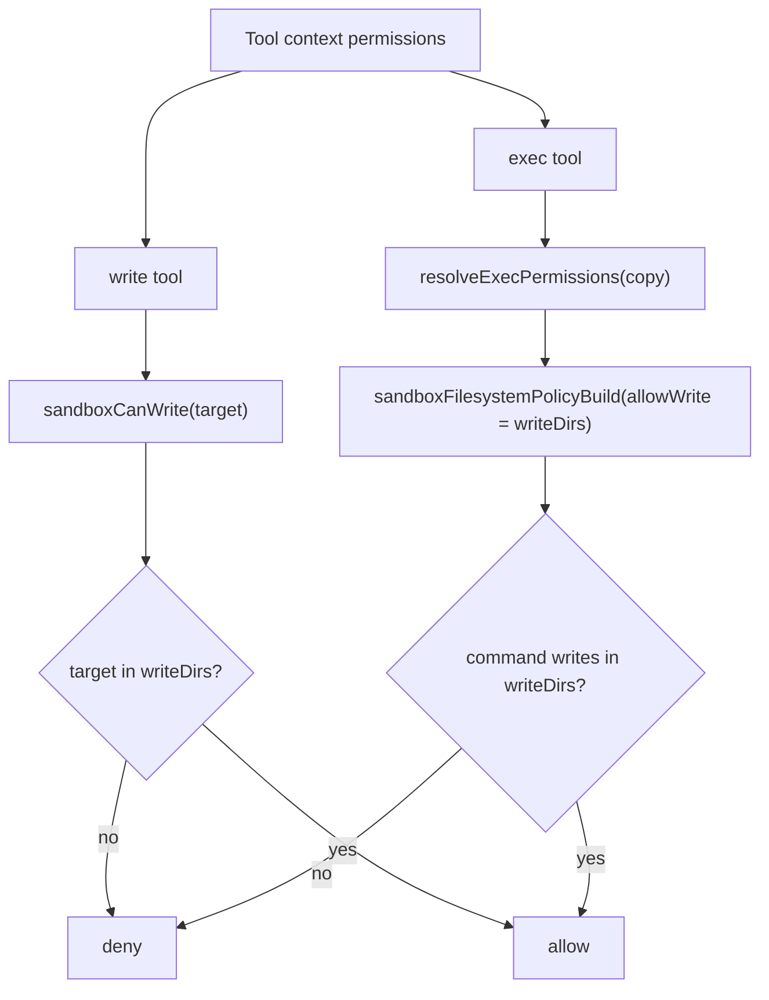

# Exec/Write Permission Parity

`exec` now uses the same caller-scoped write allowlist as `write` and `edit`.

Before:
- `exec` replaced caller permissions with `writeDirs: ["/tmp"]`
- `write`/`edit` used caller `writeDirs`

Now:
- `exec` copies caller permissions and preserves `writeDirs`
- `/tmp` is writable only when explicitly granted in caller permissions

