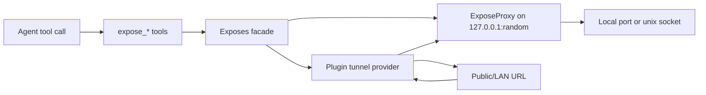
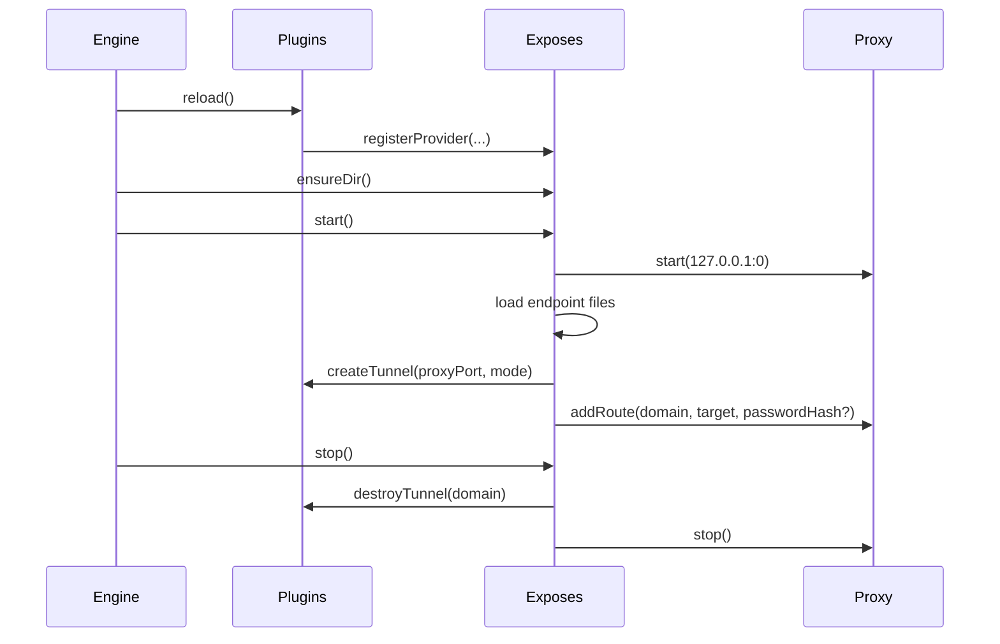
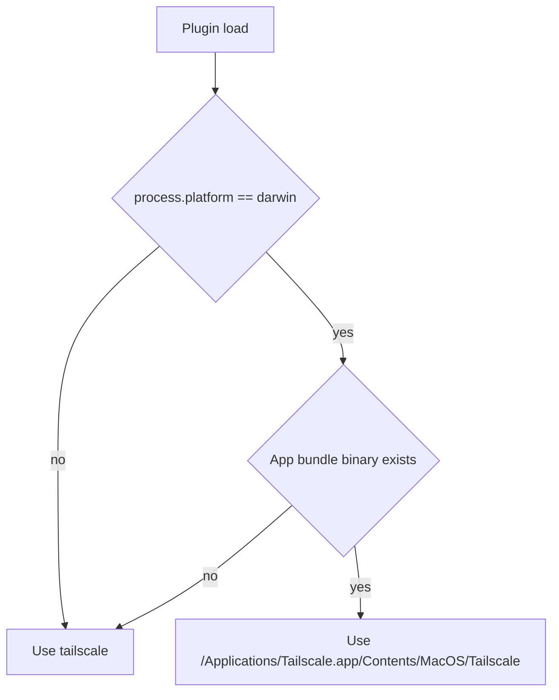
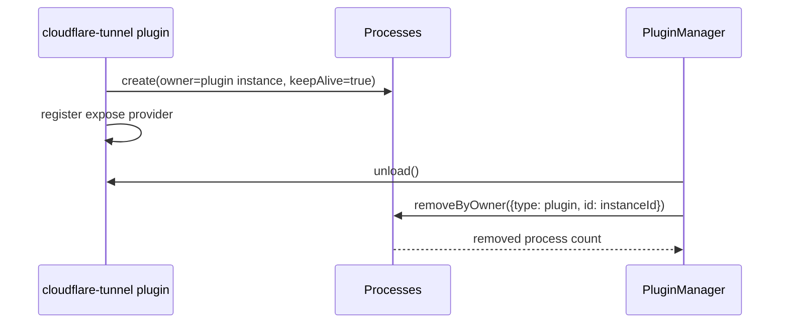
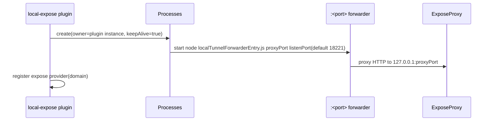

# Expose module

## Overview
The expose module adds runtime-managed tunnel endpoints so agents can publish local HTTP services.

Core pieces:
- `Exposes` facade: endpoint lifecycle, provider registry, persistence
- `ExposeProxy`: single local reverse proxy with host routing + optional Basic auth
- Provider plugins: `tailscale`, `cloudflare-tunnel`, `custom-tunnel`, `local-expose`
- Core tools: `expose_create`, `expose_update`, `expose_remove`, `expose_list`

Endpoint state persists under:
- `configDir/expose/endpoints/<endpointId>.json`

## Runtime flow

## Startup and shutdown

## Authentication model
- Endpoint auth is optional.
- When enabled, username is fixed to `daycare`.
- Password is randomly generated and returned once to the caller.
- Only bcrypt hash is persisted in endpoint JSON.
- `expose_update` regenerates a password whenever auth is enabled.

## Tailscale binary resolution
The Tailscale plugin resolves the executable path at runtime:
- macOS App Store install: `/Applications/Tailscale.app/Contents/MacOS/Tailscale`
- fallback: `tailscale` from shell `PATH`
- Endpoint domain uses machine DNS (`Self.DNSName`) directly.
- Tailscale backend supports one active expose endpoint per node profile.

## Cloudflare managed process ownership
- Cloudflare tunnel plugin now starts a durable `cloudflared` userspace process through `Processes`.
- Process owner is `{ type: "plugin", id: <pluginInstanceId> }`.
- On plugin unload/delete, plugin-owned processes are automatically removed by `PluginManager`.

## Local Expose provider on configurable local HTTP port
- `local-expose` plugin accepts a configured hostname and exposes it over plain HTTP.
- On first endpoint create, plugin starts a managed forwarder process bound to configured `0.0.0.0:<port>` (default `18221`).
- Forwarder process is created with sandbox `allowLocalBinding: true`.
- Forwarder process proxies requests to expose proxy (`127.0.0.1:<proxyPort>`) preserving host header routing.

