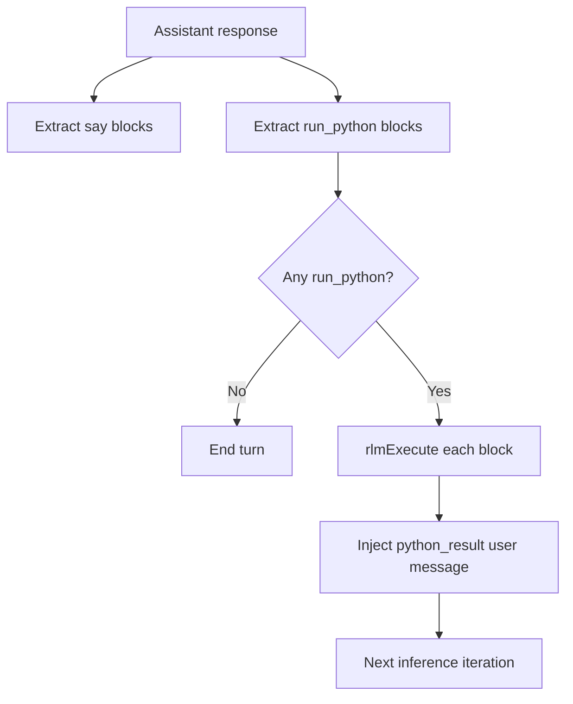

# Runtime Execution Mode

Daycare no longer uses `features` flags for operation-mode selection.

## Current behavior

- Inference receives zero classical tools.
- Python runs only through inline `<run_python>...</run_python>` blocks.
- Foreground delivery uses `<say>...</say>` blocks.

## Flow

## Configuration

The removed keys are ignored:

- `features.say`
- `features.rlm`
- `features.noTools`
