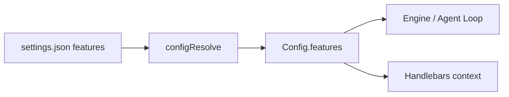
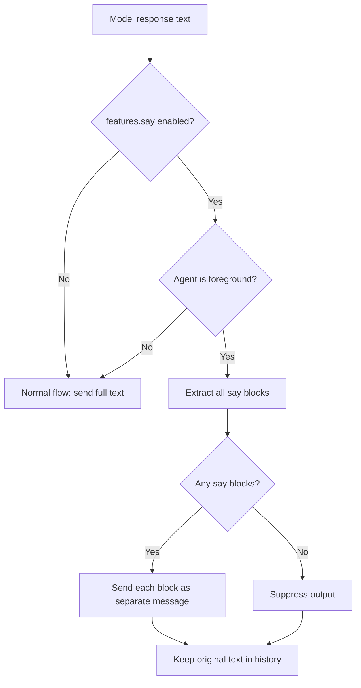

# Features Config

Feature flags live under `features` in `settings.json`. All flags default to `false`.

## Settings shape

```json
{
  "features": {
    "say": true,
    "rlm": true
  }
}
```

## Available flags

| Flag  | Default | Description |
|-------|---------|-------------|
| `rlm` | `false` | Enable RLM mode (Python execution via `run_python` tool) |
| `say` | `false` | Enable `<say>` tag mode for foreground agents |

## Resolution



Features are resolved to `ResolvedFeaturesConfig` (all fields required, defaults applied) during
`configResolve()`. The resolved features object is available both on `Config.features` and in
the Handlebars template context as `{{features.say}}`, `{{features.rlm}}`, etc.

## `<say>` tag mode

When `features.say` is enabled, foreground agents use `<say>` tags to control what the user sees:

- Only text inside `<say>...</say>` tags is forwarded to the user
- Text outside `<say>` tags is internal reasoning (never sent)
- Multiple `<say>` blocks in one response are sent as separate messages
- If no `<say>` tags are present, the entire response is suppressed
- Message history is kept unmodified (model sees its own reasoning)
- Background agents are not affected (say feature is foreground-only)


