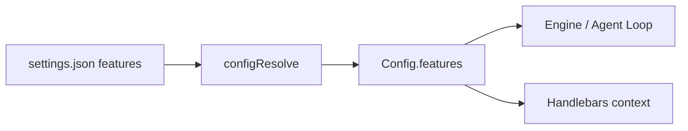
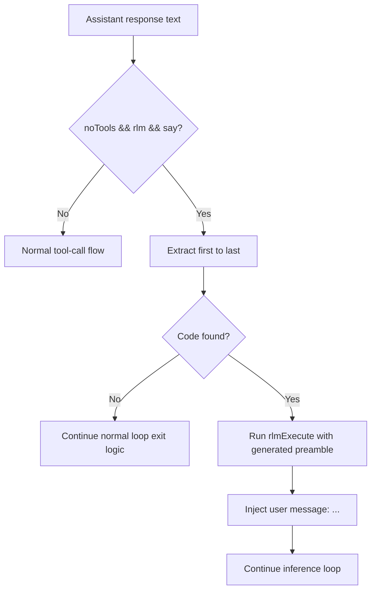
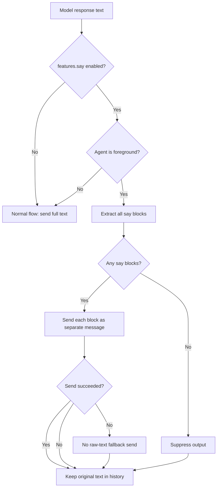

# Features Config

Feature flags live under `features` in `settings.json`. All flags default to `false`.

## Settings shape

```json
{
  "features": {
    "say": true,
    "rlm": true,
    "noTools": false
  }
}
```

## Available flags

| Flag | Default | Description |
|------|---------|-------------|
| `rlm` | `false` | Enable RLM tool-call mode (Python execution via `run_python` tool) |
| `noTools` | `false` | Enable tag-based RLM mode (`<run_python>` / `<python_result>`) with zero exposed tools |
| `say` | `false` | Enable `<say>` tag mode for foreground agents |

## Resolution



Features are resolved to `ResolvedFeaturesConfig` (all fields required, defaults applied) during
`configResolve()`. The resolved features object is available both on `Config.features` and in
the Handlebars template context as `{{features.say}}`, `{{features.rlm}}`, `{{features.noTools}}`, etc.

## noTools RLM mode

Tag-based RLM mode is enabled only when all three flags are true:

- `features.noTools`
- `features.rlm`
- `features.say`

When all three are enabled:

- The model receives zero tools in context
- The system prompt injects Python stubs and `<run_python>` instructions
- Python execution results are injected back into model context as `<python_result>` user messages
- Tag-based execution is active and context tools are hidden



## `<say>` tag mode

When `features.say` is enabled, foreground agents use `<say>` tags to control what the user sees:

- Only text inside `<say>...</say>` tags is forwarded to the user
- Text outside `<say>` tags is internal reasoning (never sent)
- Multiple `<say>` blocks in one response are sent as separate messages
- If no `<say>` tags are present, the entire response is suppressed
- When `<say>` blocks are present, raw assistant text fallback is always suppressed
- Message history is kept unmodified (model sees its own reasoning)
- Background agents are not affected (say feature is foreground-only)


