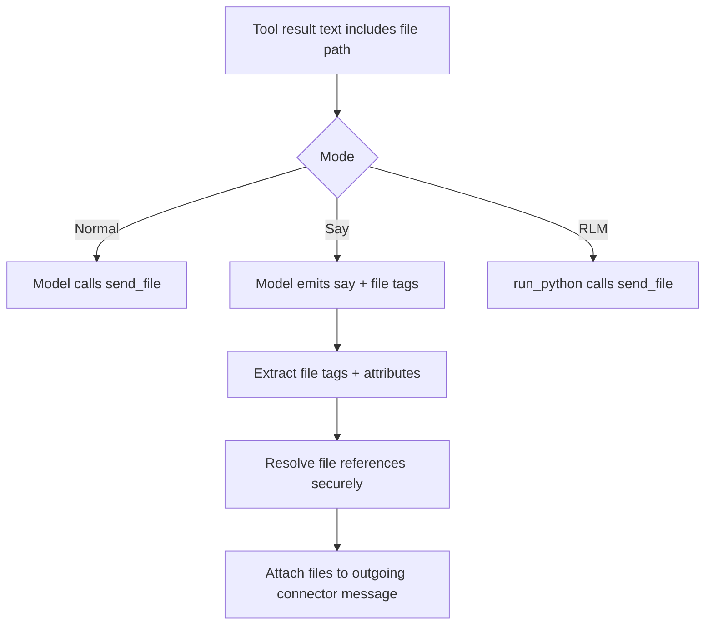

# Unified File Delivery

Daycare now uses one explicit file-delivery model across runtime modes:

- Normal mode: tools return text only; files are delivered only through `send_file`.
- Say mode (`features.say`): model can attach files with `<file>` tags alongside `<say>`.
- RLM mode: unchanged; file delivery still happens via tool calls (`send_file`) from executed code.

## Behavior

- `ToolExecutionResult` no longer contains a `files` array.
- `agentLoopRun` no longer auto-attaches files returned by tools at loop completion.
- `generate_image` and `generate_mermaid_png` report output paths in text so the model can decide when to send.

## Say Mode `<file>` Tags

Supported syntax:

- `<file>/path/to/file.ext</file>`
- `<file mode="doc">/path/to/report.pdf</file>`
- `<file mode="photo">/path/to/image.png</file>`
- `<file mode="video">/path/to/clip.mp4</file>`

Mode mapping:

- `(none)` -> `auto`
- `doc` -> `document`
- `photo` -> `photo`
- `video` -> `video`

Resolution order in say mode:

1. Existing file-store path lookup (if path points to a stored file).
2. Secure filesystem resolution within session read scope.
3. Unresolvable files are skipped with a warning.

## Flow

