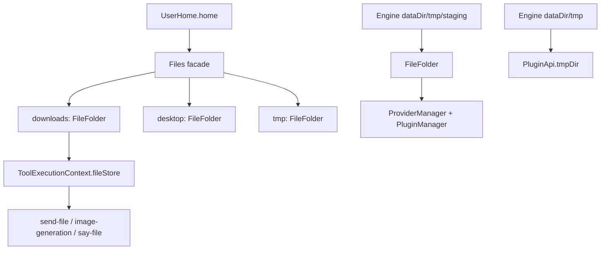

# Files Facade

The engine now uses `FileFolder` and `Files` instead of the legacy `FileStore` class.

- `FileFolder` wraps a single directory and exposes `saveBuffer()` and `saveFromPath()`.
- `Files` is a user-home facade with three folders:
  - `downloads`
  - `desktop`
  - `tmp`
- Agent tool execution receives `files.downloads` as `ToolExecutionContext.fileStore`.
- Engine-level provider/plugin scratch space uses a standalone `FileFolder` under `dataDir/tmp/staging`.
- Plugins receive `tmpDir` in `PluginApi`, pointing to shared `.daycare/tmp`.

