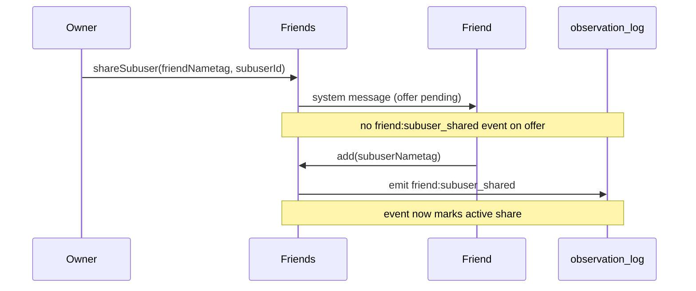
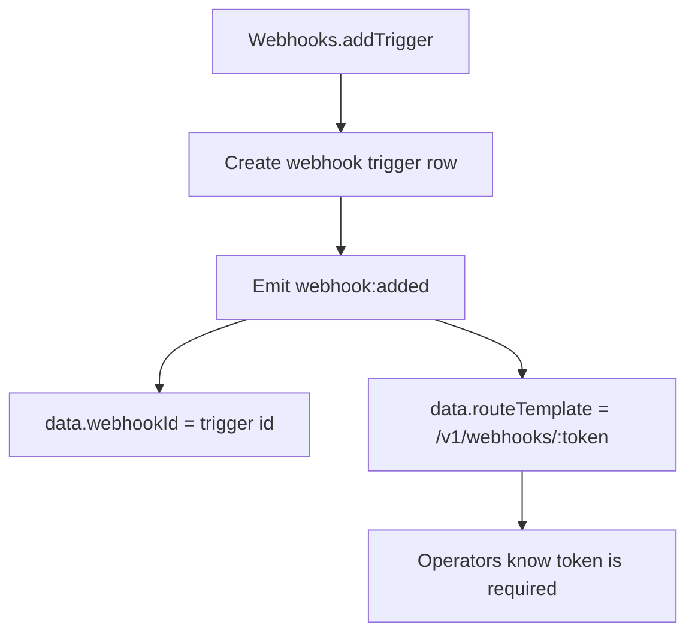

# Friend share activation and webhook route-template observations

This change aligns two topography observation semantics:

1. `friend:subuser_shared` now means **accepted/active access**, not just offer sent.
2. `webhook:added` now logs `routeTemplate: "/v1/webhooks/:token"` instead of an id-shaped path.

## Subuser-share activation

`friend_share_subuser` still creates a pending offer in `connections`, but no longer emits `friend:subuser_shared`.
The event is emitted when the friend accepts via `friend_add(<subuserNametag>)`.

## Webhook-added route semantics

`webhook:added` observations now avoid logging a non-callable id path.
The record uses a tokenized route template and keeps `webhookId` for lookup.

