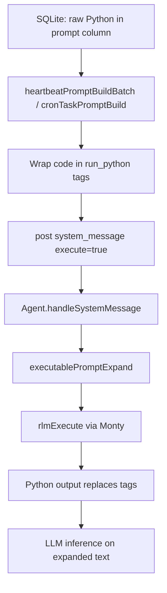

# Heartbeat & Cron: Python-Only Code

Heartbeat and cron tasks store raw Python code instead of natural language prompts. The `code` parameter in `heartbeat_add` and `cron_add` tools accepts Python that has access to all agent tools as functions.

## Why Python-only

Python code is deterministic and can call tools directly without LLM inference overhead. The agent tools are available as Python functions via the RLM preamble, and `skip()` aborts inference when there is nothing to report.

## Execution flow

## Internal wrapping

The DB column stays `prompt` for backward compatibility. The wrapping happens at the prompt-building layer:

- **Heartbeat**: `heartbeatPromptBuildBatch()` wraps each task's code in `<run_python>` tags
- **Cron**: `cronTaskPromptBuild()` wraps the task code in `<run_python>` tags

The existing `executablePromptExpand` → `rlmExecute` pipeline processes the tags unchanged.

## Tool parameter mapping

| Tool | User-facing parameter | Internal field |
|------|----------------------|----------------|
| `heartbeat_add` | `code` | `prompt` |
| `cron_add` | `code` | `prompt` |
| `cron_read_task` | returns `code` in details | reads from `prompt` |
