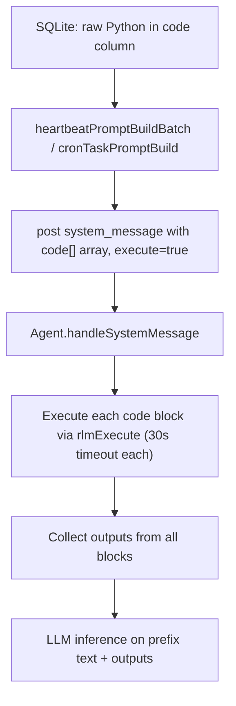

# Heartbeat & Cron: Python-Only Code

Heartbeat and cron execute raw Python from unified task rows (`tasks.code`). Task tools accept Python that has
access to all agent tools as functions.

## Why Python-only

Python code is deterministic and can call tools directly without LLM inference overhead. The agent tools are available as Python functions via the RLM preamble, and `skip()` aborts inference when there is nothing to report.

## Execution flow

## Direct execution model

The agent receives a structured `code: string[]` field on the inbox message alongside prefix `text`. In `handleSystemMessage`:

1. Each code block is executed separately via `rlmExecute` with its own 30s timeout
2. If any block returns `skipTurn`, inference is aborted (return null)
3. Outputs are collected and merged with the prefix text
4. The combined text is sent to LLM inference

## Prompt builders

- **Heartbeat**: `heartbeatPromptBuildBatch()` returns `{ title, text, code[] }` — text has task context, code has Python blocks
- **Cron**: `cronTaskPromptBuild()` returns `{ text, code[] }` — text has cron metadata, code has a single Python block

## Tool parameter mapping

| Tool | User-facing parameter | DB column |
|------|----------------------|-----------|
| `task_create` | `code` | `tasks.code` |
| `task_update` | `code` | `tasks.code` |
| `task_read` | returns task code in details | `tasks.code` |
