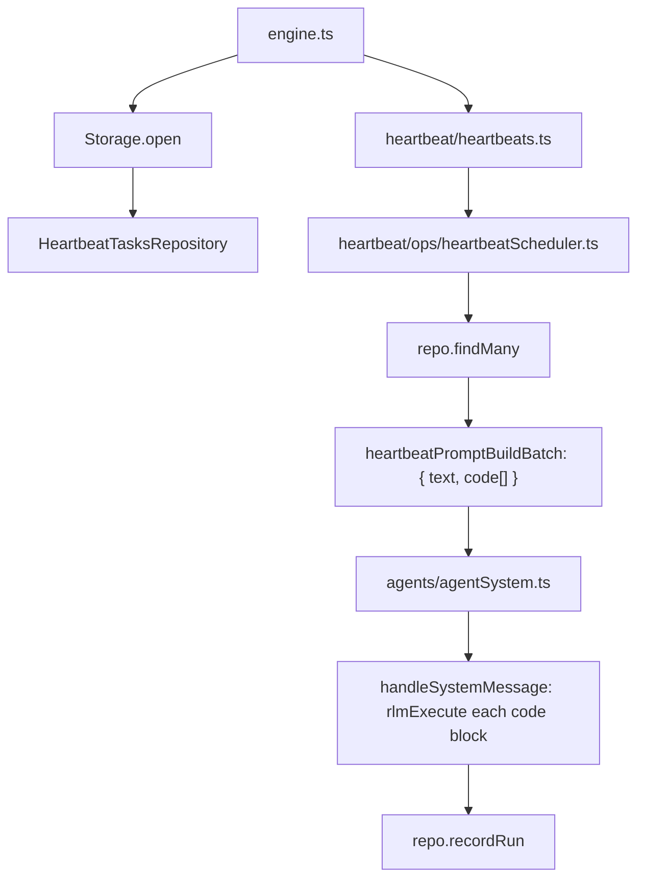

# Heartbeats

Heartbeat tasks store Python code in SQLite and execute it in a single batch on a fixed interval.

## Storage

Rows live in `tasks_heartbeat`:
- `id`, `title`, `code` (Python code)
- `last_run_at` (unix ms)
- `created_at`, `updated_at`

## Execution model

- `Heartbeats` wires `HeartbeatScheduler` with `HeartbeatTasksRepository`.
- On each interval (or `heartbeat_run`), scheduler loads tasks.
- `heartbeatPromptBuildBatch` returns `{ title, text, code[] }` with task context and Python code blocks.
- The message is posted as `system_message` with `code[]` array and `execute=true`.
- `handleSystemMessage` executes each code block separately via `rlmExecute` (30s timeout each).
- After run, `recordRun()` updates `last_run_at` for all heartbeat rows.

## Tools

- `heartbeat_add` creates/updates a task with Python code
- `heartbeat_run` forces immediate run
- `heartbeat_remove` deletes a task row
