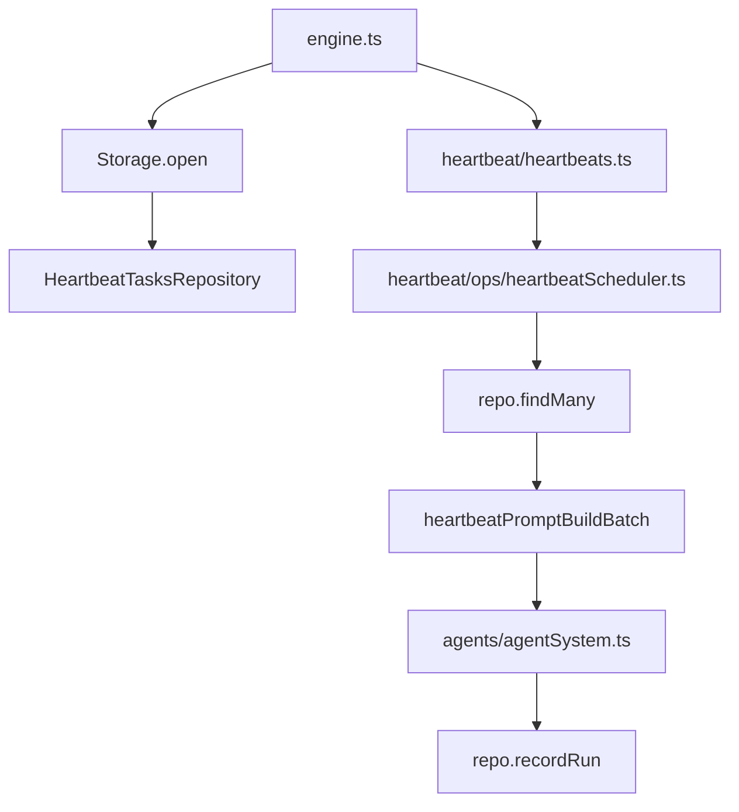

# Heartbeats

Heartbeat tasks are stored in SQLite and executed in a single batch on a fixed interval.

## Storage

Rows live in `tasks_heartbeat`:
- `id`, `title`, `prompt`
- `last_run_at` (unix ms)
- `created_at`, `updated_at`

## Execution model

- `Heartbeats` wires `HeartbeatScheduler` with `HeartbeatTasksRepository`.
- On each interval (or `heartbeat_run`), scheduler loads tasks.
- All tasks are merged into one batch prompt.
- After run, `recordRun()` updates `last_run_at` for all heartbeat rows.

## Tools

- `heartbeat_add` creates/updates a task row
- `heartbeat_run` forces immediate run
- `heartbeat_remove` deletes a task row
