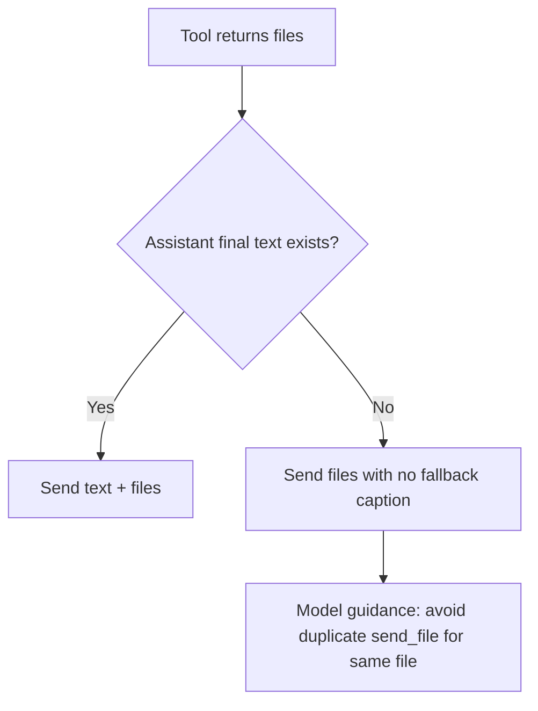

# Generated Image Reply Behavior

`agentLoopRun` now sends generated files without the synthetic `Generated files.` caption, and the system prompt explicitly tells models not to resend those files with `send_file` unless asked.

## Problem

The fallback caption made image replies noisy, and models could still produce duplicate sends by calling `send_file` again.

## Behavior

- When a tool returns files and no final text is present, Daycare sends files with `text: null`.
- `SYSTEM.md` now instructs models: files returned by tools (including `generate_image`) are auto-attached, so do not re-send with `send_file` unless the user explicitly asks.

## Flow

