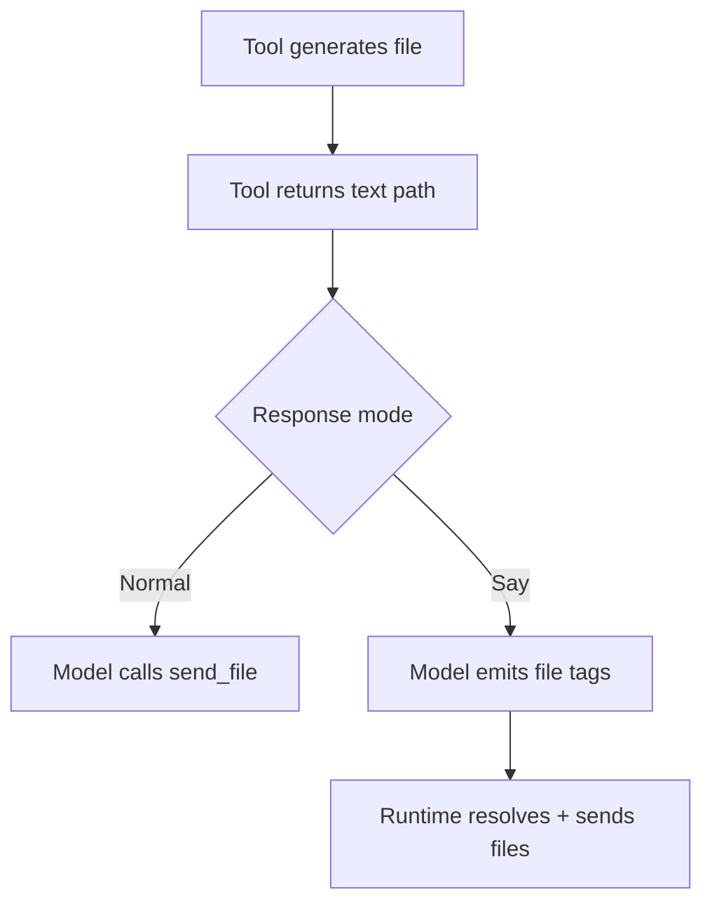

# Generated Image Reply Behavior

Auto-attach for tool-generated files was removed.

## Current Behavior

- `generate_image` and `generate_mermaid_png` return file paths in text.
- Daycare does not auto-send those files after tool execution.
- Models must explicitly send files:
  - Normal mode: use `send_file`.
  - Say mode: use `<file>` tags (optionally with `mode`).

## Flow

