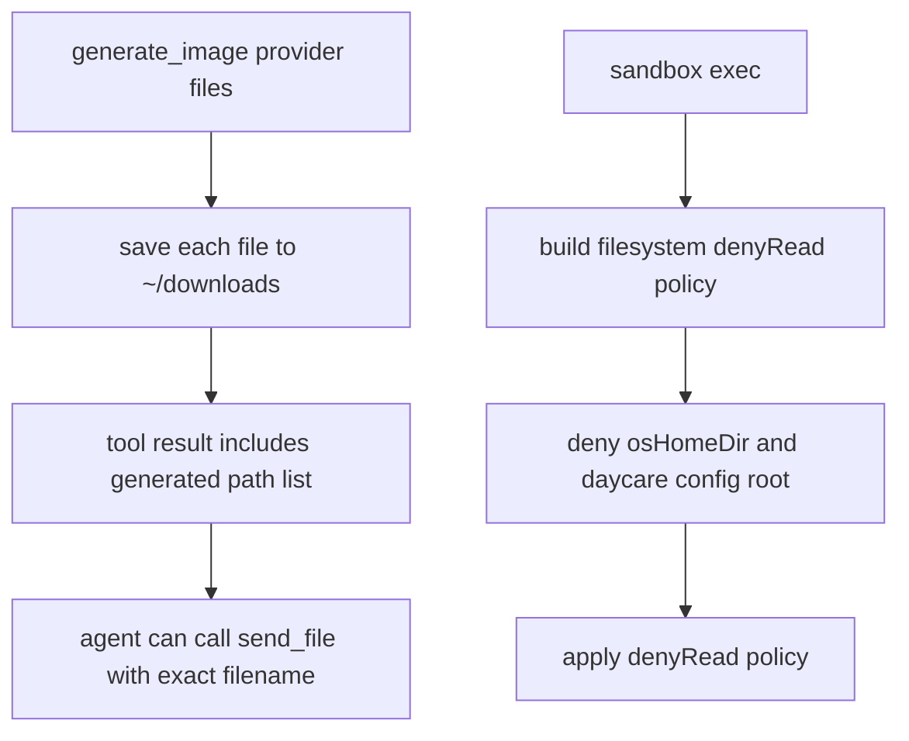

# Image Output And Sandbox Home Policy

## Summary

Two runtime issues were addressed:

1. `generate_image` now returns concrete generated file paths (not only the downloads directory).
2. Sandbox runtime read deny policy keeps denying the host OS home root, including when a remapped user home is nested under it.

## Flow

## Notes

- The runtime still denies sensitive paths and Daycare config paths.
- The host OS-home deny remains unconditional.
