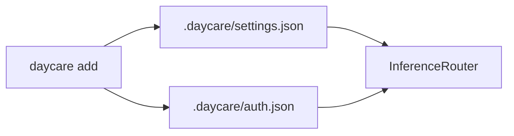
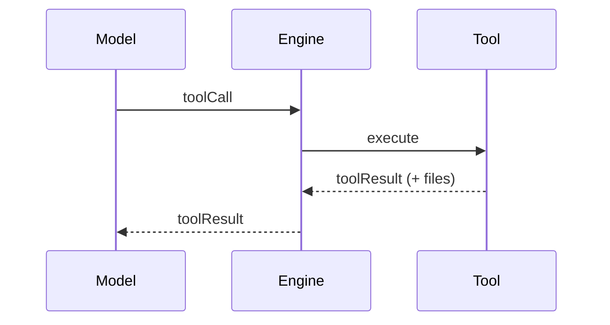
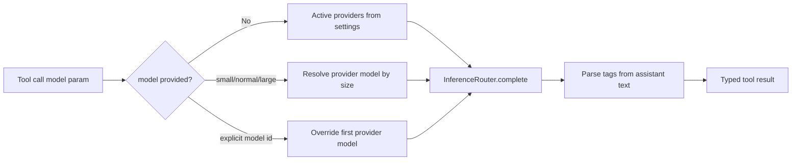
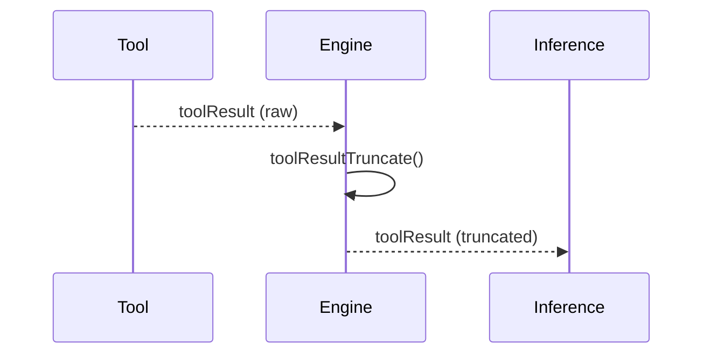
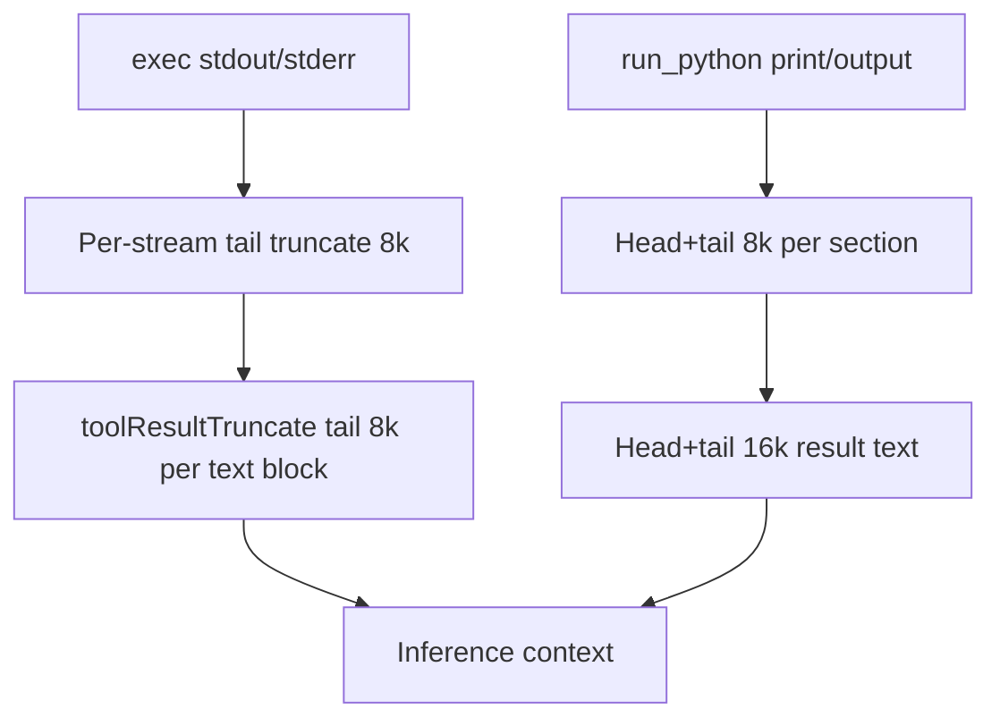
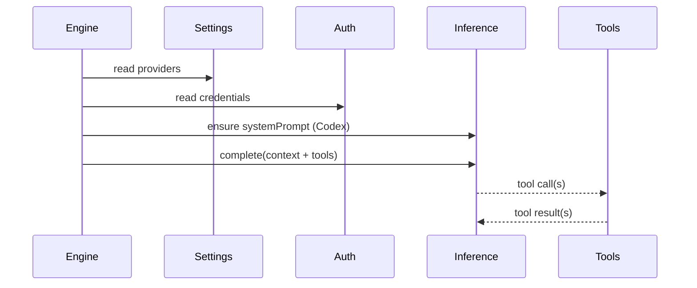

# Inference runtime

Inference is provided by built-in providers. They register with the `InferenceRegistry`,
and the `InferenceRouter` selects them based on `.daycare/settings.json`.

## Providers
Configured in settings (in priority order):
```json
{
  "providers": [
    { "id": "openai", "enabled": true, "model": "gpt-4o-mini" }
  ]
}
```

`daycare add` stores providers in priority order; disabled providers are skipped.
`daycare providers` moves the selected provider to the top of the priority list.



## Tools
Tools are registered dynamically by plugins and core runtime:
- `task_create` creates a unified task (and optional cron/heartbeat trigger).
- `task_read` reads a task and linked trigger metadata.
- `task_update` updates task `title`, `description`, and/or `code`.
- `task_delete` removes linked triggers and soft-deletes the task.
- `task_trigger_add`/`task_trigger_remove` manage task triggers.
- `memory_create_entity` creates a memory entity (requires name + description).
- `memory_upsert_record` adds or updates a memory record.
- `memory_list_entities` lists entity names + descriptions.
- `web_search` (Brave) performs web search.
- `generate_image` uses registered image providers and is only added when one is available.
- `set_reaction` sets connector reactions (Telegram).
- `read` reads a UTF-8 text file from the agent workspace or an allowed read directory (path must be absolute and within the allowed read set; large files may be truncated). By default, the read set includes the filesystem root.
- `write` writes UTF-8 text to a file in the agent workspace or an allowed write directory, creating parent directories as needed (path must be absolute and within the allowed write set; supports append).
- `edit` applies sequential find/replace edits to a file in the agent workspace or an allowed write directory (each edit must match at least once; path must be absolute and within the allowed write set).
- `exec` runs a shell command with the working directory locked to the agent workspace (or a subdirectory within it); cwd must be absolute and resolve inside the workspace. Writes are sandboxed to the allowed write set.
- `request_permission` asks the user to grant a permission like `@write:/path`, `@read:/path`, or `@network` (paths must be absolute). Background requests are routed through the most recent foreground agent.
- `inference_summary` runs a focused summarization inference call and returns `{ summary }`. It requires `task`, wraps `<task>` + `<text>` in the user message, expects the model response in `<summary>` tags, and supports optional model selection (`small`, `normal`, `large`, or explicit model id).
- `inference_classify` runs a focused classification inference call and returns `{ summary, class }`. It requires `task`, wraps `<task>` + `<categories>` + `<text>` in the user message, validates `<class>` against caller variants, and supports optional model selection.
- For both tools, non-string `task`, `text`, and classify variant values are converted with `JSON.stringify` before sending to inference.



## Inference helper tool flow
Both inference helper tools use the same model resolution path.



## Tool result truncation
Very large tool outputs are truncated before being stored in the inference context.



Current truncation limits:
- `toolResultTruncate` (all tool text blocks): tail-biased, `8000` chars per text block.
- `exec` stream formatting: tail-biased, `8000` chars each for `stdout` and `stderr` before combining.
- `run_python` result text (`rlmResultTextBuild`): head+tail, `16000` chars total.
- `run_python` sub-sections (`printOutput`, `output`): head+tail, `8000` chars each before composing final text.




