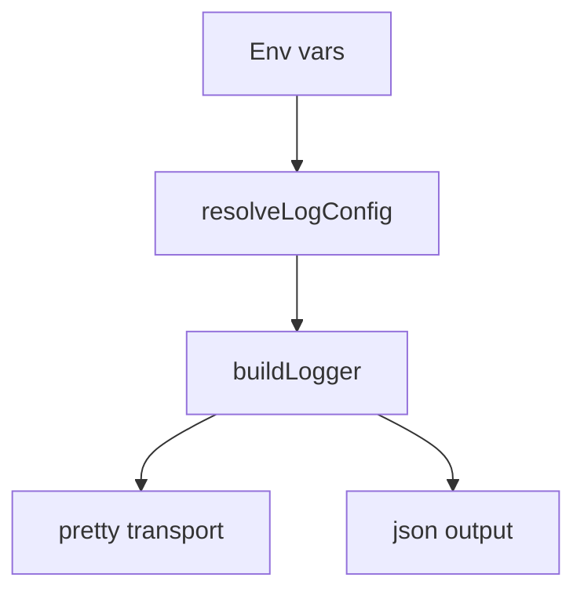
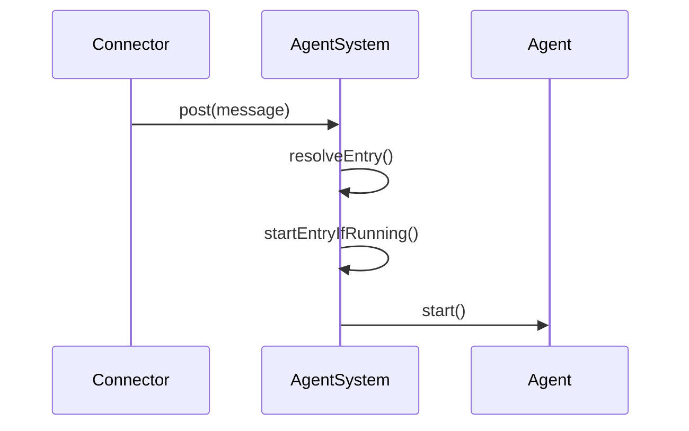
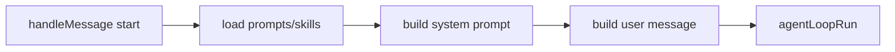
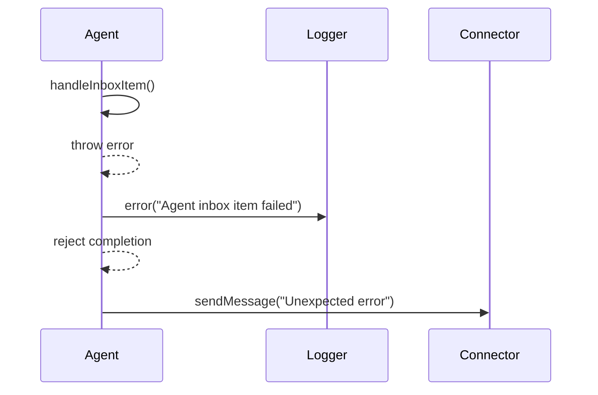

# Logging

Logging is centralized in `sources/log.ts` and uses Pino.

## Configuration
Environment variables:
- `DAYCARE_LOG_LEVEL` / `LOG_LEVEL`
- `DAYCARE_LOG_FORMAT` / `LOG_FORMAT` (`pretty` or `json`)
- `DAYCARE_LOG_DEST` / `LOG_DEST` (`stdout`, `stderr`, or file path)
- `DAYCARE_LOG_REDACT` (comma-separated paths)

Defaults:
- `debug` level in development, `info` in production
- `pretty` format in TTY + non-production
- `json` otherwise
- redaction for `token`, `password`, `secret`, `apiKey` and dotted variants

## Pretty Output

Pretty output uses a fixed-width module label and time-only prefix:

```
[HH:MM:ss] [module               ] message text
```

- Module labels are trimmed/padded to 20 characters.
- Plugin modules use the `plugin.` prefix and render as `(module     )`.
- Missing module values render as `unknown`.
- Warning messages (level `warn`) are highlighted in yellow.



## Verbose Logging

The codebase includes extensive verbose logging at the `debug` level. Debug logging is enabled by default in development mode (`yarn dev`).

To disable verbose logging in dev mode:
```bash
DAYCARE_LOG_LEVEL=info yarn dev
```

### Verbose Log Components

Debug logs include key data embedded in the message text using `key=value` format:

| Component | Module | What it logs |
|-----------|-------|--------------|
| Engine | `engine.runtime` | Message processing flow, inference loop, tool execution, agent lifecycle |
| Agent System | `engine.agent-system` | Agent creation, inbox handling, restore/load |
| Agent | `engine.agent` | Agent prompt building, history handling |
| Inference Router | `inference.router` | Provider selection, fallback attempts, client creation, completion calls |
| Plugin Manager | `plugins.manager` | Plugin load/unload, settings sync, module loading |
| Provider Manager | `providers.manager` | Provider sync, load/unload |
| Connectors | `connectors.registry` | Connector registration, message handling |
| Inference Registry | `inference.registry` | Provider registration |
| Image Registry | `image.registry` | Image provider registration |
| Tool Resolver | `engine.modules` | Tool registration, execution, validation |
| Cron Scheduler | `cron.scheduler` | Task scheduling, dispatch |
| Telegram | `connector.telegram` | Polling, message send/receive, file handling |
| IPC Server | `engine.server` | API requests, SSE connections |

### Agent lifecycle traces

Debug logs now include explicit lifecycle steps that show when an incoming message
creates and starts an agent loop.



### Agent message checkpoints

Message handling logs include step markers so stalls are visible.



### Agent inbox failure logs

If an inbox item throws, the loop logs an error entry (including message + stack fields),
rejects the pending completion, and attempts to notify the user channel with a short
error message.



### Example: Debug Message Flow

```bash
# Debug logging is enabled by default in dev mode
yarn dev
```

Example output tracing a message:
```
[09:41:12] (telegram            ) Received Telegram message chatId=123 messageId=456
[09:41:12] (telegram            ) Dispatching to handlers handlerCount=1 channelId=123
[09:41:12] [engine.runtime      ] Handling connector.message event
[09:41:12] [engine.agent-system ] post() called source=telegram agentType=user
[09:41:12] [engine.agent        ] handleMessage() called agentId=anthropic:user-123 messageId=abc hasText=true textLength=15 fileCount=0
[09:41:12] [engine.runtime      ] Inference loop iteration=0 agentId=anthropic:user-123 messageCount=1
[09:41:12] [inference.router    ] Trying provider providerIndex=0 providerId=anthropic model=claude-sonnet-4-20250514
[09:41:12] [inference.router    ] Creating inference client providerId=anthropic model=claude-sonnet-4-20250514
[09:41:12] [inference.router    ] Calling client.complete() providerId=anthropic modelId=claude-sonnet-4-20250514 agentId=anthropic:user-123
[09:41:12] [inference.router    ] Inference completed successfully providerId=anthropic modelId=claude-sonnet-4-20250514 stopReason=end_turn contentBlocks=1 inputTokens=50 outputTokens=100
[09:41:12] [engine.modules      ] Extracted tool calls from response toolCallCount=0
[09:41:12] [engine.runtime      ] No tool calls, breaking inference loop iteration=0
[09:41:12] (telegram            ) Sending response to user textLength=200 fileCount=0 targetId=123
[09:41:12] (telegram            ) Response sent successfully
[09:41:12] [engine.runtime      ] handleMessage completed successfully
```

### Filtering Logs

To filter by module label:
```bash
DAYCARE_LOG_LEVEL=debug yarn dev 2>&1 | grep -F "[inference.router"
```

To filter by specific key:
```bash
DAYCARE_LOG_LEVEL=debug yarn dev 2>&1 | grep "agentId="
```
