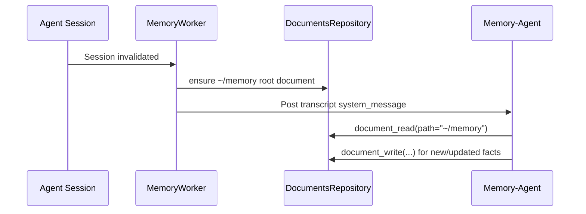
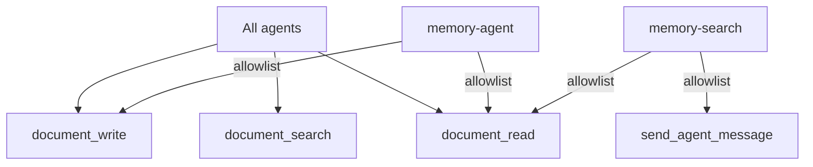

# Memory to Documents Migration

Memory storage is now backed by `documents` instead of markdown graph files.

## Runtime Flow

## Tool Surface

## Removed Components

- `engine/memory/graph/*`
- `engine/memory/memory.ts` (`Memory` facade)
- Legacy tools:
  - `memory_node_read`
  - `memory_node_write`
  - `search_memory`

## Added Components

- `document_read`
- `document_write`
- `document_search`
- `memoryRootDocumentEnsure()` for `~/memory` bootstrap

