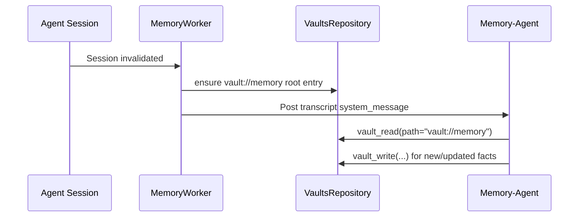
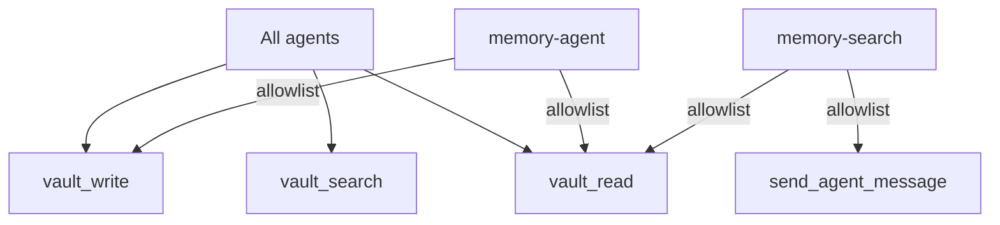

# Memory to Vault Migration

Memory storage is now backed by the `documents` tables instead of markdown graph files, while the public surface is exposed as the vault.

## Runtime Flow

```mermaid
sequenceDiagram
    participant A as Agent Session
    participant MW as MemoryWorker
    participant DR as VaultsRepository
    participant MA as Memory-Agent

    A->>MW: Session invalidated
    MW->>DR: ensure vault://memory root entry
    MW->>MA: Post transcript system_message
    MA->>DR: vault_read(path="vault://memory")
    MA->>DR: vault_write(...) for new/updated facts
```

## Tool Surface

```mermaid
graph TD
    AllAgents[All agents] --> vault_read
    AllAgents --> vault_write
    AllAgents --> vault_search

    MemoryAgent[memory-agent] -->|allowlist| vault_read
    MemoryAgent -->|allowlist| vault_write

    MemorySearch[memory-search] -->|allowlist| vault_read
    MemorySearch -->|allowlist| send_agent_message
```

## Removed Components

- `engine/memory/graph/*`
- `engine/memory/memory.ts` (`Memory` facade)
- Legacy tools:
  - `memory_node_read`
  - `memory_node_write`
  - `search_memory`

## Added Components

- `vault_read`
- `vault_write`
- `vault_search`
- `memoryRootVaultEnsure()` for `vault://memory` bootstrap
