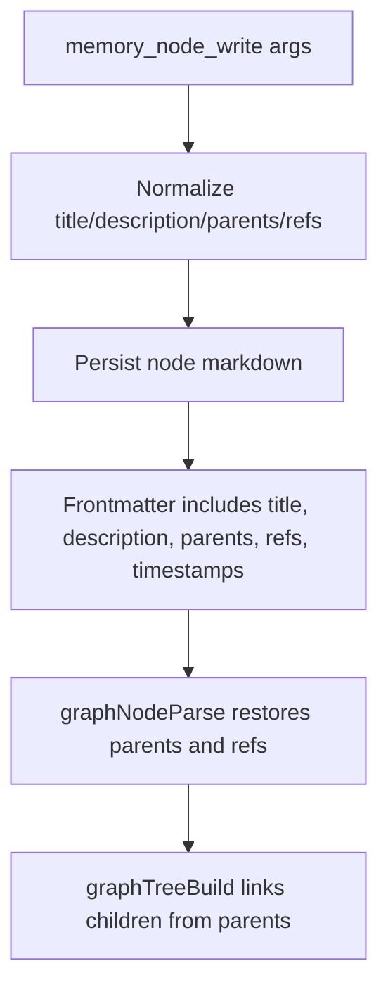

# Memory Graph Frontmatter Requirements

This change makes memory graph metadata strict and persistent so structure and references do not disappear between writes and reads.

## What Changed

- `memory_node_write` now requires a non-empty `description`.
- `memory_node_write` now writes `parents` into frontmatter and validates they are non-empty after normalization.
- `memory_node_write` requires `parents` to be explicitly provided at call time.
- Parent id alias `"root"` is normalized to `__root__` (for top-level nodes), but callers still must supply at least one parent.
- Node `refs` are now serialized into frontmatter and parsed back.
- Graph hierarchy now uses `frontmatter.parents` instead of inferring parent/child links from `refs`.
- The memory-agent prompt now explicitly requires `description` for each node.

## Data Flow

## Compatibility Notes

- Existing nodes without `parents` are attached to `__root__` when parsed.
- Existing wiki-link refs in body content are still recognized and merged with frontmatter `refs`.
